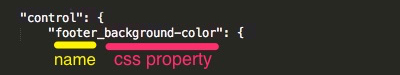

Options (Fields)
================

Options are the core elements of the customizer feature, which allows users to customize their theme by picking the colors from the color palette, uploading a logo image, changing the font size and color etc...

Option Types
------------

* Color picker (palette)
* Text field
* Text area
* File (upload and browser)
* Date
* Button
* Checkbox
* Radio
* URL

<div class="uk-alert">
Customizer uses Arastta Form component, so you can see the list of <strong>all</strong> available form elements from <a href="https://github.com/arastta/form/tree/master/Element" title="Arastta Form Elements">Arastta Form's elements on GitHub</a>
</div>


Here is a minimum customizer.json file example:

```
{
"colors": {
	"title": "text_colors_title",
	"description": "text_colors_description",
	"control": {
		"footer_background-color": {
			"type": "color",
			"label": "text_colors_footer_background_label",
			"default": "#f5f5f5",
			"selector": "body"
		},
        "footer_color": {
                "type": "color",
                "label": "text_colors_footer_color_label",
                "default": "#666",
                "selector": "body"
        }
	}
}    
```

In this example, all options are grouped under a group with the name **colors**. You can get more information about the [Groups](docs/designers/customizer/groups).

To register your options (fields) in the customizer file, you need to register them in a variable called **control**. In the above example, you can see 2 different options defined in the **control** variable.

One is the **footer_background-color** and the other one is the **footer_color**. As you can see, underscores and dashes used in the both example and there is a reason for that.

### Name and CSS Property ###

The first part which comes before the underscore is the name of the option and the second part which comes after the underscore is the **CSS property**. 



So, you can name your option and then put an underscore and type the CSS property you want, like `background-color`, `color`, `background-image`, `font-weight`, `width`, `height`...

### Type ###

Then you need to register properties of this option. As you can see, the first property is the **type**. There are lots of option types you can choose from. You can see the complete list of the types from [Arastta Form component's GitHub page](https://github.com/arastta/form/tree/master/Element). In the example we used **color** as the type, so in this option a color palette will be displayed to the user and users can choose their desired colors from the palette.


### Label ###

This is the label of the option which is displayed to the users. You can hardcode the label or provide a string which is translatable.

### Default ###

You can define a default value for your option, so users can _undo_ or _reset_ their customizations.

### Selector ###

This is where you define the **CSS Selector***, so Customizer finds this selector in the DOM and apply the changes and customizations to that selector.