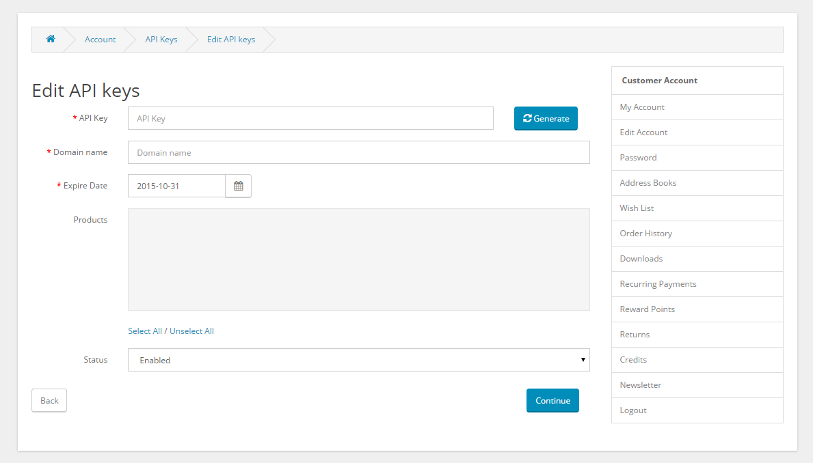
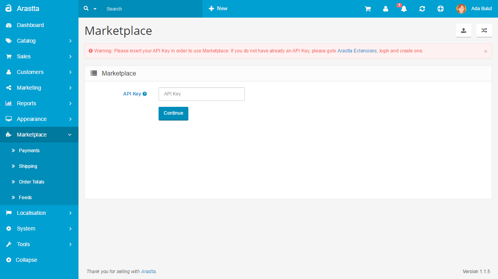
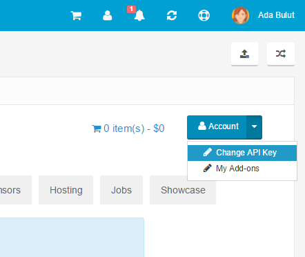

How to activate Marketplace?
====================

API Keys
-----------------

That is maybe the best part of our marketplace. You have one master API key and unlimited slave API keys. API keys are used when you try to access the Marketplace from inside Arastta software. You can restrict slave keys per domain, time and products. Lets say your client didn't renew the contract, you can freely delete that slave key and inhibit your client to install the addons assigned to that key. Domain assignment prevents keys to be copied and used on other domains by your clients.

To Implement API Keys with your Arastta Store, you need to complete the following steps:

###STEP 1: Obtaining a new API Key

To get a new API Key for your Arastta store you will first need to login to Arastta Marketplace area and access the **[API Keys](http://extensions.arastta.pro/index.php?route=account/api)** section.

Click on "**New API**" button and create slave API Keys for your customers. Use the "**Generate**" button for a random key.

###STEP 2: Implementing the API Key in Arastta

Login to your Arastta admin dashboard and navigate to **Marketplace**. Insert the API Key you've created.

Use the "**Change API Key**" section if you want to change the valid API Key you entered before.

You have successfully activate **Marketplace** service for Arastta Store.