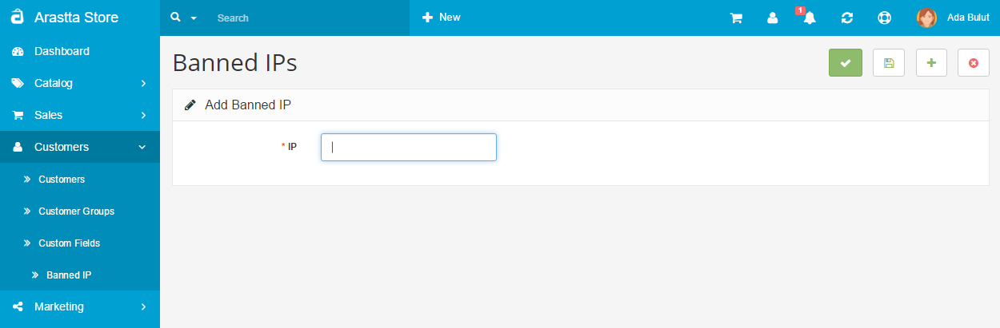

How to ban visitors by IP address?
====================

Access control is a vital part of the management process of a website, an online store, etc. We all know that there are people on the Internet who we don’t want on our website. Whether they are just annoying spammers or mischievous hackers representing a considerable threat to our website’s security, it is without doubt very important to know a way or two to block them off.

##Ban by IP using the Arastta Admin Dashboard

The Admin Dashboard provides the easiest way to enable or disable visitor access on your store. The process is fairly simple:

1. First, login to your admin control panel.
2. Go to **Customers > Customers > Banned IP**
3. Click the **Add New** button which is located in the top right corner.
4. Type in the IP address you want blocked from your website.
5. When you are ready, hit Save.

As you can see, the power to ban by IP is only a few clicks away.

##Handling security on the server side

The other way to employ access control relies on the server, rather than the Arastta application. It can be done by using two methods - modifying the .htaccess file and using the cPanel IP Address Deny Manager. The latter, of course, is only possible if your hosting service is providing a cPanel.

###Using the .htaccess file

1. Go to your Arastta installation.
2. Open the .htaccess file (if you don’t have one, you can create one yourself, just create a new file and save it as .htaccess)
3. In this file, using the keywords **Deny** from, you can enlist the IPs that you want to restrict from viewing your website, eg.: **Deny** from *120.24.134.25*

4. Using **Allow** from, you can enlist IPs which will be allowed to visit your website, eg.: **Allow** from *120.24.134.25*
5. You can combine Deny from and Allow from using the Order keyword, eg.:
    
    Order deny, allow
    
    Deny from all
    
    Allow from 120.24.134.25
    
This way you can enable only certain visitors to your website.

###Using the cPanel IP Address Deny Manager

1. Login to your cPanel.
2. Scroll down to the Security section.
3. Open the **IP Address Deny Manager**. This page you will see will be something like this:
4. Type the IP you want to block.
5. Hit Add.
6. You will be redirected to a success page, if you click Back, you can see the IP you typed in the list with other restricted IPs.

####That’s all!

It is up to you to choose your preferred method. The one using the Arastta admin panel is the easiest, but the others provide you with the opportunity to enlist a lot of IPs much faster. In the **cPanel IP Address Deny Manager** for example, you can type *120.24.134.25 -120.24.134.50* and all the IPs in between will be added to the list.

