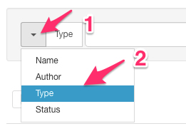
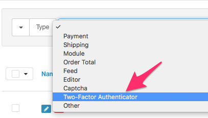
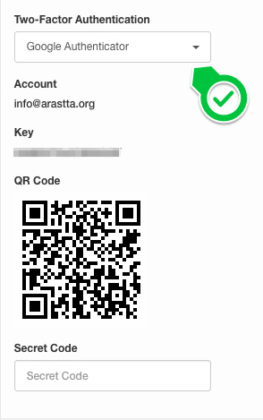

How to Enable Two-Factor Authentication?
========================================

Two-Factor Authentication is one of the most important security measures you can take for your Arastta store, which implements another level of security for your admin panel. You can get more information about [Two-Factor Authentication](https://en.wikipedia.org/wiki/Multi-factor_authentication) from Wikipedia.

There are 2 different authentication plugins which are available for Arastta out of the box:

* Google Authenticator (Google 2-Step Verification)
* YubiKey

Enable plugins
--------------

Before setting up a Two-Factor Authentication for your store, you need to enable one of the authenticator extensions. Navigate to **Extensions > View All...**.

All available extensions will be listed on the page and you can find authenticator extensions. An easy way to find them is to filtering extensions. To filter authenticator extensions, choose **Type** first from the filter area at the top of the page.

Then, choose **Two-Factor Authenticator** from the list and all authenticator extensions will be filtered automatically. You can enable the extension(s) you want to use on your store. You need to visit YubiKey's detail page by clicking edit button (pencil icon) to provide required API details.

Enabling Two-Factor Authentication per User
---------------------------

After enabling the authenticator extension(s), you can enable Two-Factor Authentication per user. To do so, navigate to **System > Users > Users** menu and edit one of your users.

Under **Option** tab, you will see **Two-Factor Authentication** dropdown list, there you can choose your desired authenticator for that user. After choosing it, respective settings will be displayed, just fill in the fields and click on the save button to enable **Two-Factor Authentication** for the user.

