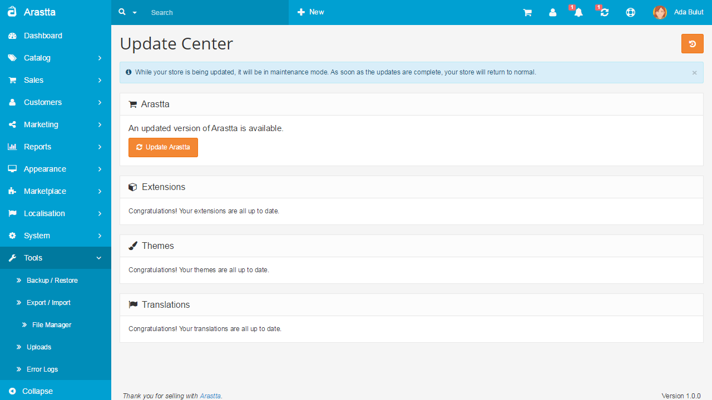
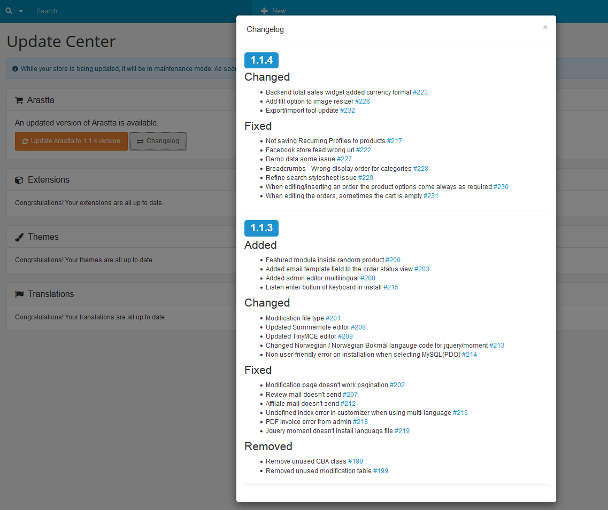

Update
======

Updating Arastta
----------------

Arastta is periodically updated with new versions of itself. It is a good idea to update your store with each new version released to take advantage of bug fixes and new features.

Thanks to the One-click Update feature of Arastta, it takes just a couple of minutes to get the latest version. All you have to do is to click the Update notification button at the right top. After that you will be redirected to the "Update Center" page.

There you will see 4 sections, **Arastta**, **Extensions**, **Themes** and **Translations**. The fisrt section is valid only for the Arastta version, the second is valid for all extensions published on [Extensions ](http://extensions.arastta.pro/), the third is valid for all themes published on [Themes ](http://themes.arastta.pro/) and the last is valid for all translations published on [Translations ](http://translations.arastta.pro/).

When you are using the latest version of Arastta then you will see a message on top saying "*Congratulations! Your store is up to date.*".

The **Changelog** button will display the changelog of all missing versions on a pop-up window so you will be informed about all new features, changes, fixes and removes for each version.

