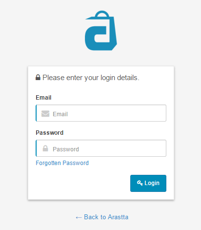
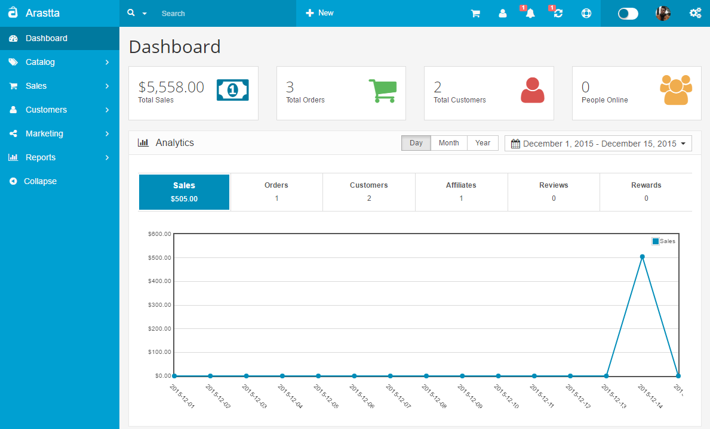
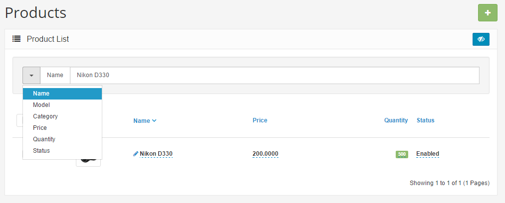

Admin Panel
===========

Arastta administration
----------------------

   You can switch between Basic and Advanced modes from the tabs below.

<ul class="uk-tab" data-uk-tab="{connect:'#doc-tabs', animation: 'fade'}">
    <li><a href="">Basic Mode</a></li>
    <li><a href="">Advanced Mode</a></li>
</ul>

Arastta's administration side of the store is where you can modify features, upload images, add products, keep track of customers, manage payments, and much more. Customization in the admin affects how the customer will interact with a store: by modifying the look, structure, and content of the store front.

Accessing the admin panel
-------------------------

To access the admin panel, type in location of the store into the web browser followed by "/admin". For example, if your store is located at "www.chocolatechip.com", your admin panel is located at "www.chocolatechip.com/admin". Even if the store is located in a sub-folder or on a sub-domain of their site, adding "/admin" to the end of the store's path will lead you to the administration side.

If the name of the folder is changed by you during installation, the location of the admin panel is changed to that new name. For example, if the name of the admin folder is changed to admin1, the new location of the admin panel is at "www.chocolatchip.com/admin1".

<i class="uk-icon-check-circle"></i> Changing the name of the admin folder to another name is important for improving an online shop's security. The config.php file needs to be edited to indicate the correct file path and location. A username and password is created in <a href="docs/installation">Step 3 of the auto-installer</a> during installation. This information can now be used to fill in the administrator login details.

After filling in the correct email and password, pressing the "Login" button will direct you to the Arastta dashboard. When you first login to your shop, the dashboard will be blank (as seen below), because there isn't any statistical data to be analysed yet.

Dashboard
---------

The dashboard is the first thing you will see when entering Arastta's admin. The main function of the dashboard is to give the shop owner an overview of how the shop is performing. There are 3 sections of the dashboard that can help you understand the statistical data collected by your store:

- **Top:** Arastta calculates the numerical values for "*Total Sales*", "*Total Orders*", "*Total Customers*" and "*People Online*" to alert you to approvals and keeping track of sales.
- **Sales Analytics:** A graph is provided to track the chronological progress of the store relative to the amount of *Sales*, *Orders*, *Customers*, *Affiliates*, *Reviews* and *Rewards* over time. The x value is time; which can be hours, days, or months depending on the range selected. The y value displays the number of total sales(blue), total orders(green), total customers(red), total affiliates(purple), total reviews(orange) and total affiliates(brown).
- **Sales and Products:** A list that displays the last 10 orders, best & less 5 sellers, and most 5 viewed products.
- **World Map:** It shows the total orders and sales based on countries.

In the left side of the dashboard is the administration navigation menu. You can navigate between the "Catalog", "**Sales**", "**Customers**", "**Marketing**", "**Reports**", "**Appeearance**", "**Marketplace**", "**Localisation**", "**System**" and "**Tools**". These sections will be explained in further detail in the following sections of the User Guide.

Filter
------

Filter is a handy tool used regularly throughout the Arastta administration. You may type into one of the information field for the item on the item list. Pressing Filter will "filter out" all the items in the list that do no match the criteria entered in the space, leaving only the items that match. With Filter, you can quickly locate any information stored in list form. **Products, Categories, Customers, Reports, Orders**, and more all use Filter as the main search tool to locate items in a list.

For examples, if you would like to look up a product in the product list, you can use "Filter" as a shortcut to search for that product. This can be helpful when there is large amounts of product and you would like to edit a specific product without having to browse through every page for it. The search boxes are located in the first row above the product list.

<ul id="doc-tabs" class="uk-switcher uk-margin">
    <li markdown="1"></li>
    <li markdown="1"></li>
</ul>

In the screenshot above, "nikon" is typed into the "Product Name" information field. "Filter" only displays what matches "nikon". The Nikon D300 is the only product displayed because it is the only product name containing the words "nikon" in this shop. If the "nikon" wording was present in more than one product name, the "Filter" button would display all of them.

<ul id="doc-tabs" class="uk-switcher uk-margin">
    <li markdown="1">
<i class="uk-icon-info-circle"></i>There is no any button named "Filter", as in advanced mode, because the button name will be changeable according what you are searching. In this example the button name is "Name", you should click on it for filtering.
</li>
    <li markdown="1"></li>
</ul>
