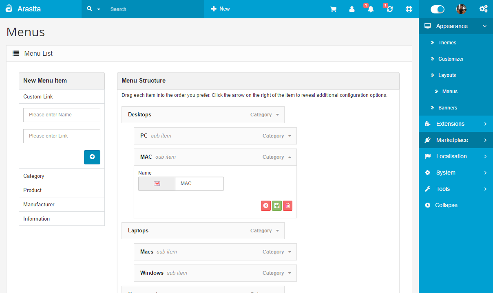

Menus
=====

Menus are very important for a website no matter what platform you are using. All big boys like Joomla, WordPress, Drupal etc. has a menu manager in order let you customize it. However, system like OpenCart are lacking in such areas. I believe you already wanted to modify your top header menu bar and add some links or some kind of advertising links for your buyers. In such a case, the only solution is to get your hands dirty and dive into the code.

With Arastta, you should just go to the **Appearance > Menus** and create or edit menu items with just **drag & drop**.

Custom Links
------------

Thanks to its extendability, you can create menu items for your products, categories, manufacturers, informations or even custom links with ease. After creating, just drag & drop and Arastta will automatically save the menu item position. You can also change depth of menu items by just dragging them in or out.

Multi-Language and Multi-Store
------------------------------

You can set different text to menu items for each store and assign them to different & multiple stores.

Ajaxified
---------

The menu item creating, saving, moving, deleting etc process is all Ajaxified so users don't need to navigate from one web form to another.