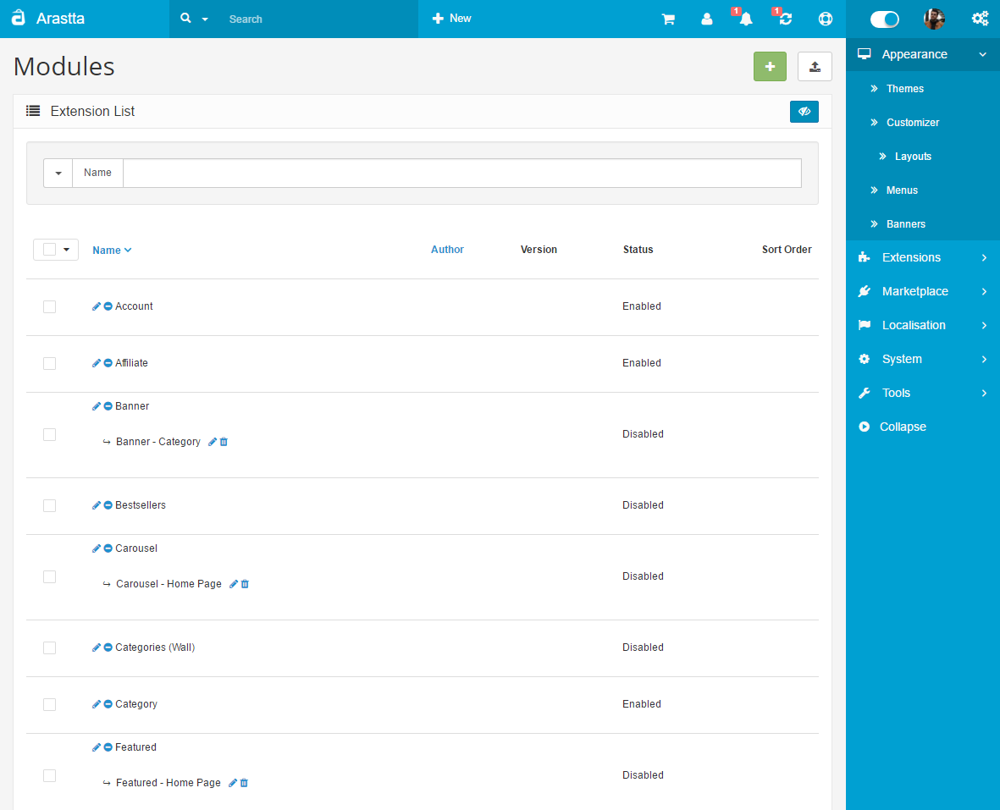
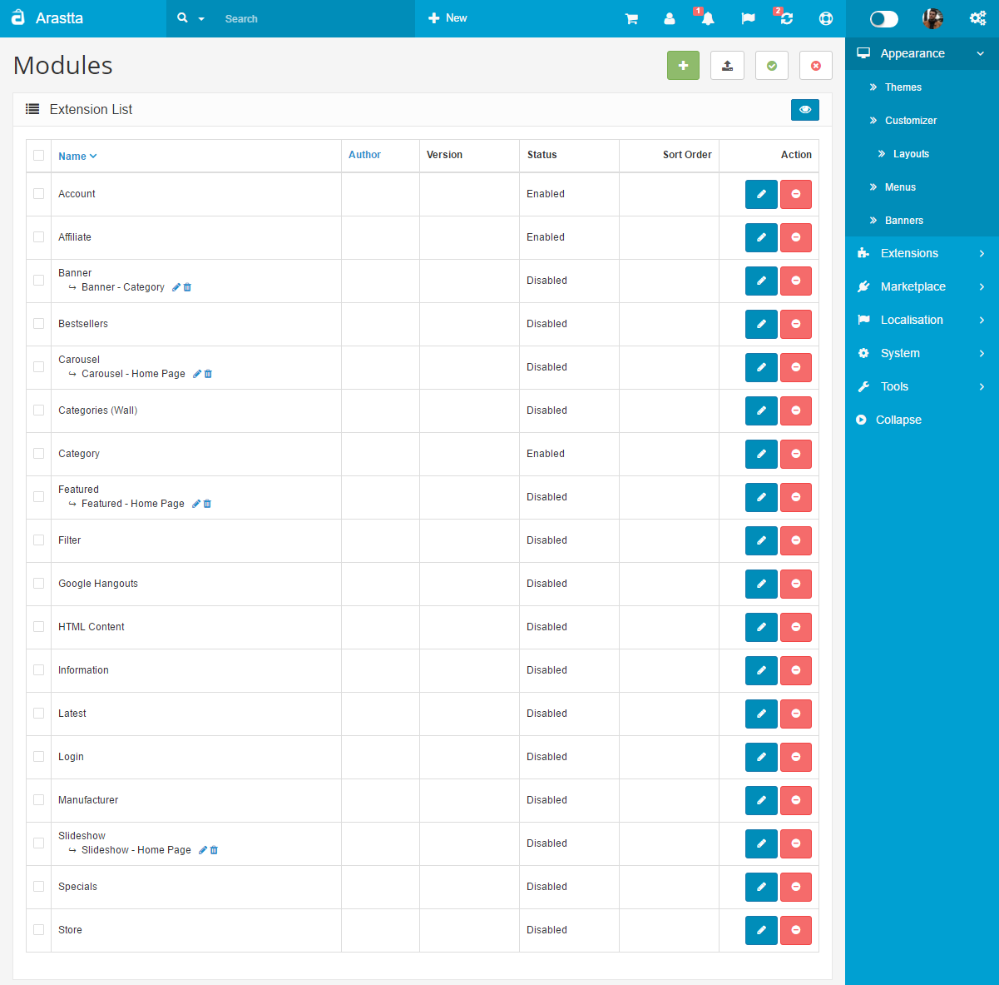

Overview
========

Core Modules Overview
---------------------

   You can switch between Basic and Advanced modes from the tabs below.

<ul class="uk-tab" data-uk-tab="{connect:'#doc-tabs', animation: 'fade'}">
    <li><a href="">Basic Mode</a></li>
    <li><a href="">Advanced Mode</a></li>
</ul>

There are 18 free core modules provided with the latest version of Arastta:

- **Account:** The User Account links (My Account, Edit Account, Order History, etc) box for the customer to access.
- **Affiliate:** Links for the store's affiliate program is made available in a box for affiliates to access.
- **Banners**: Adds an image banner with icons linking to different products or manufacturers in the store.
- **Bestsellers:** Adds a window displaying the best sellers wherever position/page it is specified.
- **Carousel:** Displays banner that can be navigated through as a slideshow.
- **Categories (Wall):** Displays a module on the top below the header. It contains selected categories and subcategories of the store.
- **Category:** Displays a module containing all the categories and subcategories of the store.
- **Featured:** Displays a feature box containing selected products.
- **Filter:** Displays a module containing all filters of the store.
- **Google Hangouts**: A chat box used with a Google account to interact with customers.
- **HTML Content:** This module allows to display any content (image, HTML, links, etc.).
- **Information:** Adds the information tab containing the Information pages (About Us, Delivery Info, Privacy Policy, Terms&Conditions)
- **Latest**: Adds the latest, or most recently added, products in the form of product icons to a product box on a page.
- **Login:** Displays the login module.
- **Manufacturer:** Displays the Manufacturer list on a module.
- **Slideshow:** Displays a slideshow module containing banners created in [Banners](docs/user-manual/appearance/banners) page. You can set the width and height of the module.
- **Specials:** Displays all the products with Specials in a product box. Specials can be added to products in the [Special tab](docs/user-manual/catalog/products/special).
- **Store:** Creates a box for the customer to select another store to visit if there are multiple stores managed with Arastta.

<ul id="doc-tabs" class="uk-switcher uk-margin">
    <li markdown="1"></li>
    <li markdown="1"></li>
</ul>

All of these modules can be manipulated with the Layout, Position, Status, and Sort Order tools in Modules.
