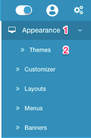
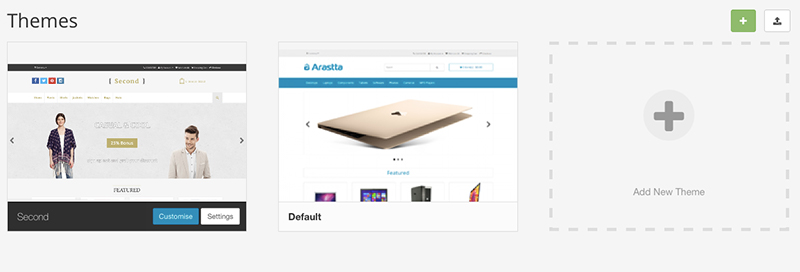
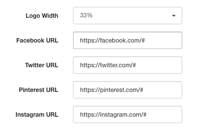

Second Theme
============

Arastta project releases one new theme each year and **Second Theme** is the second default theme released by the project. Just like its predecessor Defaul theme, Second Theme is fully responsive eCommerce theme which can be used on various eCommerce stores and websites.

Manage Theme
------------

To manage Second Theme you need to reveal the right side panel by clicking on the **cogs** icon at the top right of the page. This will open all settings related menu items of your Arastta store.

Then click on the **Appearance** menu and click on the **Themes** menu.

Thus, all your installed themes will be listed on the page.

Click on the **Settings** button to access all theme settings and options. Currently, there are **2** main settings for the Second Theme, one for logo width and the social icons.

Change logo width
-----------------

You can easily change your logo area width by choosing a value from **Logo Width** dropdown list. You can choose:

* 25% (1/4)
* 33% (1/3)
* 50% (1/2)
* 75% (3/4)
* 100% (Full width)

When you choose any of the above values, social icon area's and cart area's width will be adjusted accordingly.

Display social icons and define their links
-----------------

Currently, there are 4 social icons to display: Facebook, Twitter, Pinterest, Instagram. In the next updates new icons are planned to be added.

You can copy and paste your social profile links into the respective fields. When you fill a field, that icon will be displayed on the theme. If you want to hide one or more icons, just delete its content (remove the link) and save your theme.
