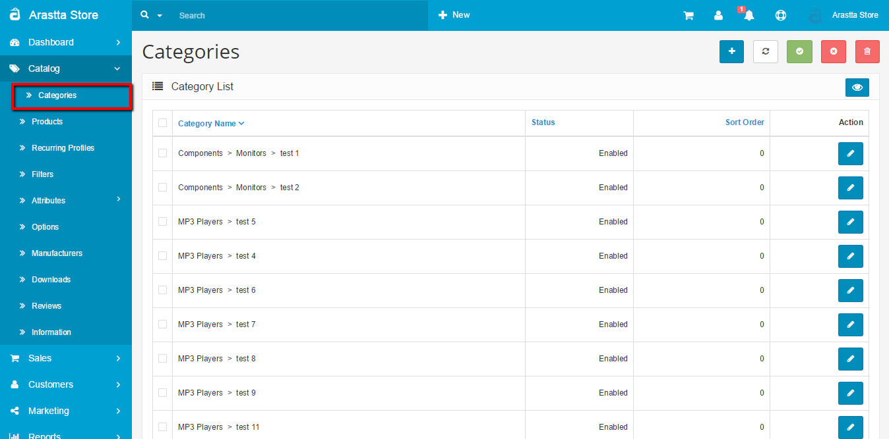

Overview
========

Categories
----------

In the default theme of the store front, parent categories are listed in the top menu of the home page, and on the left side of product pages. This navigational feature is used to guide customers to similar products within the same category. Exposing customers to different products within a category lets the customer compare the similarities and differences between products to make the most informed purchase. When adding products to the store, you will be asked for a product category to sort them in. It is a good idea to establish these categories before adding products, to save yourself the trouble of adding the category name to the products later.

<i class="uk-icon-exclamation-circle"></i> When adding a product without a product category, the product will not show up under any categories in the front end of the store. The product page can only be accessible if the customer types in the product name, one of the product tags in the search box, or visits the product through a manufacturer page. If you want this product to be more visible to your customers in the store front, we suggest that the category is created prior to adding the product.

To access the Category page in the administration, hover over the Catalog button and click on Category in the drop-down. You will be a directed to a page that displays the category names of the store products (as seen below).

The categories above were included with the default products provided by the install. You may delete them to make room for the store's product categories. To delete, check the box next to the row that the category is listed on. When the products selected for deletion are checked, "Delete" can be clicked on in the upper right corner. This should remove the product categories completely.

<i class="uk-icon-info-circle"></i> The ">" symbol points from a parent category to a sub-category. "Laptops & Notebooks > Windows" indicates that "Windows" is a sub-category sorted under the parent category "Laptops & Notebooks".

The Sort Order indicates the order that the categories are displayed in the top menu and category box on the product page. Desktop (sort order-1) will be sorted above Laptops & Notebooks (sort order-2) because it has a higher priority.

<i class="uk-icon-info-circle"></i> Leaving "Sort Order" blank will organize the sections in alphabetical order.

Clicking "**Edit**" under "Action" will direct the administrator to a form to change the category information. Clicking "**Add New**" will allow the shop owner to insert more categories to the site.

Create a category
-----------------

Before you learn how to add products, you will need to understand how to create product categories. Product category is an essential organizational feature in Arastta. Arastta organizes the structure of an online store around these product categories. Every product category gets their own space in the store to display all the available products for that category.

Organizing products into categories is useful for navigating a store's inventory in both the store front and administration side. In the administration, creating categories for products will help the shop owner keep track of specific products within a category. In the store front, customers will be able to browse their favorite products by category. Category pages can be accessed in the top menu and from the category box in the product page.

<i class="uk-icon-check-circle"></i> Before inserting products into Arastta, you should take some time to brainstorm and establish categories for your products. Think of how the products in your store can be organized into groups in a logical manner. Generally, you would want to start with creating a broad parent category, and move narrower into specification with each sub-category below it. For example, a broad category such as Electronics is a good parent category. Under the Electronics, a sub-category named "Computers" can be created; and under that category, "Laptops". You can see how each category becomes more specific as we progress. Putting effort into this task will improve a store's usability, ultimately bringing customers to other products in the store that may interest them.

Go to **Catalog > Category** in the administration. If this is your first time in the category section you will see a list of categories created for the default products. You should feel free to delete them to make room for your store's products. To create a new category for products you can click "**Add New**" in the upper right corner. You will be directed to the category's information page. Category information can be filled out under three tabs: "General", "Data", "Design".
