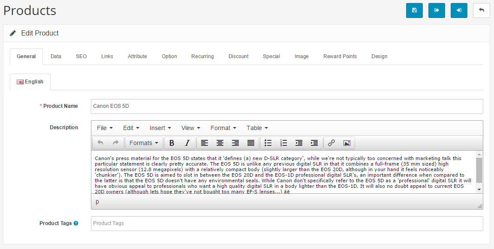

General
=======

General Tab
-----------

The format of the General tab is identical to the General tab when creating a product category, with the addition of the Product Tags feature:

- **Product Name**
- **Description**: Text that will describe this product on the product page, to be viewed by the customers in the store front of the shop.
- **Product Tags**: A tag to describe the product to the customers. If a customer types in this tag in the search box found in the header, the product will be displayed in the search results.

