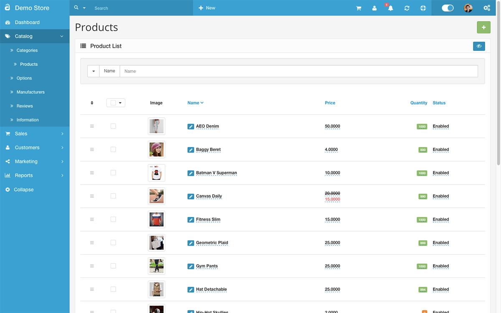
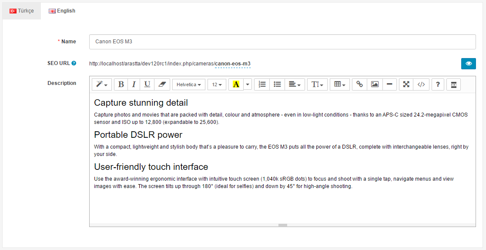
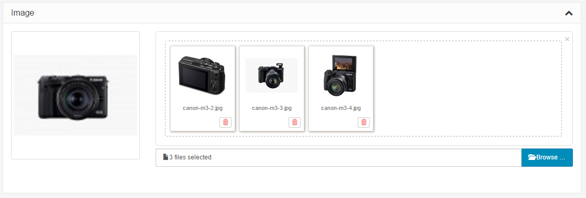
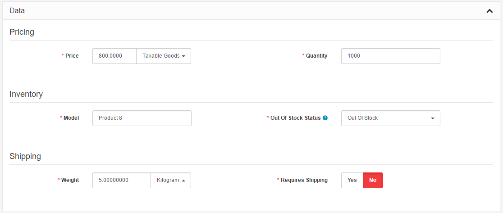
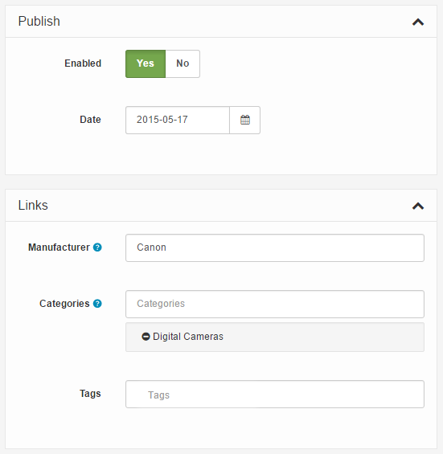
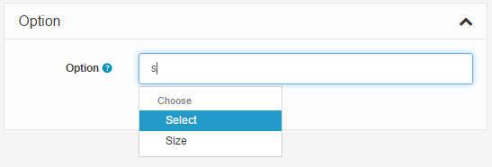
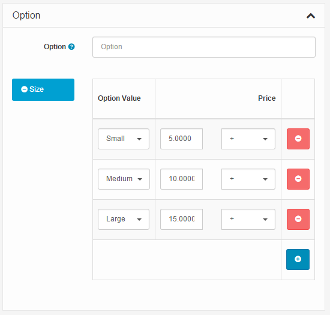

Overview
========

   You can switch between Basic and Advanced modes from the tabs below.

<ul class="uk-tab" data-uk-tab="{connect:'#doc-tabs', animation: 'fade'}">
    <li><a href="">Basic Mode</a></li>
    <li><a href="">Advanced Mode</a></li>
</ul>

<ul id="doc-tabs" class="uk-switcher uk-margin">

    <li>
    

    Products in the administration
    ------------------------------

    Products are the bread and butter of the average Arastta store. Therefore, it is essential that you learn how to manage your store's product inventory using the Arastta administration side. Before adding products, you must make sure that you have all the necessary information about the product you are adding to the store. To get detailed information of your products to your customer, Arastta requires this information to be gathered beforehand. The more information given to Arastta about a specific product, the more informed the customer will be about that particular product when purchasing it from your store.

    Products overview
    -----------------

    The Product section, accessed under Catalog, will display all the products available in the store.

    Every row of product will contain the following information:

    - **Ordering**
    - **Checkbox**    
    - **Image**
    - **Product Name**
    - **Price**
    - **Quantity**
    - **Status**: Selecting "Enabled" lets the product be visible in the store's store front. Selecting "Disabled" will remove the product from view.

    Checking an individual box in the first column will select the product information within the same row. Once selected, you can choose to "**Enable**", "**Disable**" or "**Delete**" the product.

    

    If you would like to look up a product in the product list, you can use "Filter" as a shortcut to search for it. For more information on the Filter tool, visit Filter. Pressing "**Add New**" in the top right corner will direct the administrator to a form to add new products.

    Using Bulk Actions and Quick Edit
    -----------------------------

    Bulk Actions describe the process to be performed on particular Products. These Actions can be performed on one, or more Products, at one time, if those Products have been previously selected. Bulk Actions are available, when appropriate, as choices in the Actions pulldown box, above each Table. There are three Bulk Actions allowed, **Enable**, **Disable**, and **Delete**.

    The following fields can be change via the Quick Edit Action: **Image**, **Product Name**, **Price**, **Quantity**, **Status**.

    

    Managing and adding products in the catalog
    -------------------------------------------

    The complete list of store products can be found under **Catalog > Products**. If this is your first time in the Product section, you will notice the default products left over from the installation. These products can be used to experiment with and explore the Arastta features before launching your store. You will eventually need to delete these products to make room for your store's products.

    To delete the default products:

    1. Check the box left of the "Image column" in the list. This should select all the products on the page.
    2. Click the "Delete" button on the top right side.
    3. Press "OK" when a window pops up asking "Delete/Install cannot be undone! Are you sure you want to do this?".

    There should now be a blank list to add individual products to. The "**Add New**" button directs the administrator to a page requiring product information.

    Before products are added to the administration, product categories must already be established by the administrator. See Categories before continuing with this section. With the product categories created, products are now ready to be added to the catalog.

    
<i class="uk-icon-info-circle"></i> Arastta currently only allows products to be added one at a time, not in mass quantity. Extensions can be purchased to add large amounts of product at once. See Product import for more information.

    Create a product
    ------------------

    There are five sections of information associated with each new Product: the General, Image, Data, Enabled, Publish, Links, and Option. 

    ### General

    The format of the General section is identical to the General section when creating a product category:

    - **Product Name**: The Product Name must be unique.
    - **SEO URL**: Do not enter site name or product, just the product URL. Leave empty if you want to be generated by the system automatically based on product name.
    -  **View Product button**: Allows you to view the product before officially publishing it.
    - **Description**: Text that will describe this product on the product page, to be viewed by the customers in the store front of the shop.

    

    ### Image

    The images section let the administrator add the main image and additional product images to the product page. Keep in mind additional product images will be included below that main image on the product page. You can use the "**Browse**" button to insert images or just **drag & drop** directly to images list. The drag & drop feature works fine for changing the main image by any image of additional images, or clicking "Browse Folders" will lead the administrator to the [Image Manager](docs/faq/image-manager) to upload a new main image.

    

    ### Data

    The data section includes all the product criteria that will be included on the product page in the store front for customers to view:

    

    Fill in the spaces above with the following information:

    - **Price**: set a price for the product.
    - **Tax Class**: select a tax class category on this product that was made Localisation > Taxes > Tax Classes. This will apply the tax in the checkout for the product. Select "None" if taxes will not be applied to this product.
    - **Quantity**: The total amount available in the store for this specific product.
    - **Model**: create a model number for the product using a combination of letters and numbers. (required)
    - **Out of Stock Status**: select "Out of Stock", "In Stock", "2-3 days", or "Preorder" as the message shown on the product page when the product's quantity reaches 0.
    - **Weight**: Enter a number for the weight.
    - **Weight Class**: Specify the units of weight for the number entered into "Weight".
    - **Requires Shipping**: If the product requires shipping, select "Yes". If not, select "No".

    ### Publish & Links

    

    The Publish section specifies if this product will be published or not and if yes when will be published:

    - **Enabled**: Enabling makes the product publicly available in the store. Disabling allows the product to be edited in the administration , but hides it from the store front .
    - **Data**: The date when this product will become available for purchase.

    The Links section specifies which pages Arastta will show the product on:

    - **Manufacturer**: Selecting the product's manufacturer will place the product on the manufacturer's page. Select manufacturers can be viewed on the home page if added to the [manufacturer banner](docs/user-manual/catalog/manufacturers).
    - **Categories**: Check the categories that the product will be placed into. The product will be listed on the category's page in the store.
    - **Product Tags**: A tag to describe the product to the customers. If a customer types in this tag in the search box found in the header, the product will be displayed in the search results.

    ### Option

    Options are extra selections that a customer can make on the Product page before adding the product to the shopping cart. Options are first created under Catalog > Options, then assigned to a product that is created under Catalog > Products.

    

    One example of an option is "size". Begin by typing "size" into the search box. Size should appear in a drop down box. Select it, and click on the green add button. On the right, click "Add Option Value".

    

    The Option Values were previously created in the [Options ](docs/user-manual/catalog/options)section under Catalog. In this section any option can be added, such as "Large". An increase of price can be added to the option value. Click "Add Option Value" to assign that information to that specific option value. You can click "Remove" to erase the option value. See [Options ](docs/user-manual/catalog/options)for a more in depth explanation of the options feature.

    Saving the product
    ------------------

    At this point in the guide, you will have completed all the steps and filled out all the appropriate information for the product. To complete the process of adding this product, click "Save & Close". When you return to the Products page under Catalog, you will now see this product listed. You can choose to modify any of this information included above, at any time, by clicking "Edit" across from the product.

    
    </li>
    
    <li>
    

    Products in the administration
    ------------------------------

    Products are the bread and butter of the average Arastta store. Therefore, it is essential that you learn how to manage your store's product inventory using the Arastta administration side. Before adding products, you must make sure that you have all the necessary information about the product you are adding to the store. To get detailed information of your products to your customer, Arastta requires this information to be gathered beforehand. The more information given to Arastta about a specific product, the more informed the customer will be about that particular product when purchasing it from your store.

    Products overview
    -----------------

    The Product section, accessed under Catalog, will display all the products available in the store.

    Every row of product will contain the following information:

    - **Image**
    - **Product Name**
    - **Model**
    - **Category**
    - **Price**
    - **Quantity**
    - **Status**: Selecting "Enabled" lets the product be visible in the store's store front. Selecting "Disabled" will remove the product from view.

    Checking an individual box in the first column will select the product information within the same row. Once selected, you can choose to "**Copy**", "**Enable**", "**Disable**" or "**Delete**" the product. "Copy" will duplicate the product and it's information categories. "Delete" will remove the product selection (including its information) completely.

    

    If you would like to look up a product in the product list, you can use "Filter" as a shortcut to search for it. For more information on the Filter tool, visit Filter. Pressing "**Add New**" in the top right corner will direct the administrator to a form to add new products.

    Managing and adding products in the catalog
    -------------------------------------------

    The complete list of store products can be found under **Catalog > Products**. If this is your first time in the Product section, you will notice the default products left over from the installation. These products can be used to experiment with and explore the Arastta features before launching your store. You will eventually need to delete these products to make room for your store's products.

    To delete the default products:

    1. Check the box left of the "Image column" in the list. This should select all the products on the page.
    2. Click the "Delete" button on the top right side.
    3. Press "OK" when a window pops up asking "Delete/Install cannot be undone! Are you sure you want to do this?".

    There should now be a blank list to add individual products to. The "**Add New**" button directs the administrator to a page requiring product information under the following tabs:

    - [General](docs/user-manual/catalog/products/general)
    - [Data](docs/user-manual/catalog/products/data/)
    - [SEO](docs/user-manual/catalog/products/seo/)
    - [Links](docs/user-manual/catalog/products/link/)
    - [Attribute](docs/user-manual/catalog/products/attribute/)
    - [Option](docs/user-manual/catalog/products/option/)
    - [Recurring](docs/user-manual/catalog/products/recurring/)
    - [Discount](docs/user-manual/catalog/products/discount/)
    - [Special](docs/user-manual/catalog/products/special/)
    - [Image](docs/user-manual/catalog/products/image/)
    - [Reward Points](docs/user-manual/catalog/products/reward/)
    - [Design](docs/user-manual/catalog/products/design/)

    Before products are added to the administration, product categories must already be established by the administrator. See Categories before continuing with this section. With the product categories created, products are now ready to be added to the catalog.

    
<i class="uk-icon-info-circle"></i> Arastta currently only allows products to be added one at a time, not in mass quantity. Extensions can be purchased to add large amounts of product at once. See Product import for more information.

    Saving the product
    ------------------

    At this point in the guide, you will have completed all the steps and filled out all the appropriate information for the product. To complete the process of adding this product, click "Save & Close". When you return to the Products page under Catalog, you will now see this product listed. You can choose to modify any of this information included above, at any time, by clicking "Edit" across from the product.

    
    </li>

</ul>

