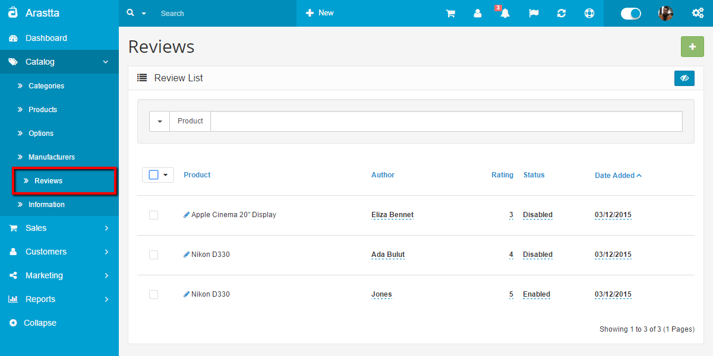
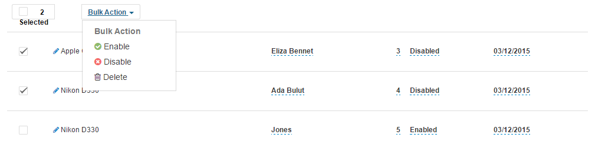
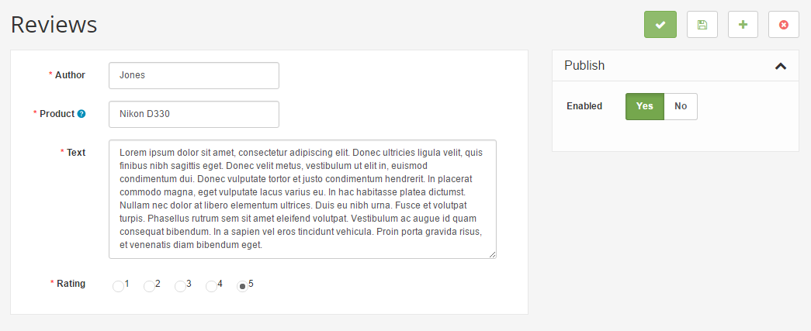
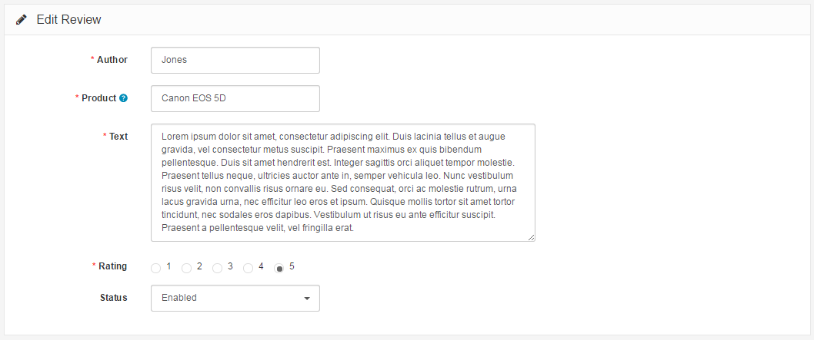

Reviews
=======

Catalog → Reviews
---------------------------

   You can switch between Basic and Advanced modes from the tabs below.

<ul class="uk-tab" data-uk-tab="{connect:'#doc-tabs', animation: 'fade'}">
    <li><a href="">Basic Mode</a></li>
    <li><a href="">Advanced Mode</a></li>
</ul>

Product reviews can be both submitted and viewed by customers on the product page. A customer can fill out a review form and submit it to be approved for publication on the site.

<ul id="doc-tabs" class="uk-switcher uk-margin">
    <li markdown="1">

In the Dashboard the administrator can view how many customer reviews are awaiting approval in the Overview section. To approve these reviews, the administrator may visit **Catalog > Reviews**, select the review, and click "edit".

Using Bulk Actions and Quick Edit
-----------------------------

Bulk Actions describe the process to be performed on particular Reviews. These Actions can be performed on one, or more Reviews, at one time, if those Reviews have been previously selected. Bulk Actions are available, when appropriate, as choices in the Actions pulldown box, above each Table. There are three Bulk Actions allowed, **Enable**, **Disable**, and **Delete**.

The following fields can be change via the Quick Edit Action: **Author**, **Rating**, **Status**, **Date Added**.

Edit a review
------------
 
 Arastta will display the author, product, and text review in separate text boxes. Selecting "enabled" under status will make the review publicly available on the product page.

</li>
    <li markdown="1">In the Dashboard the administrator can view how many customer reviews are awaiting approval in the Overview section. To approve these reviews, the administrator may visit **Catalog > Reviews**, select the review, and click "edit". Arastta will display the author, product, and text review in separate text boxes. Selecting "enabled" under status will make the review publicly available on the product page.

</li>
</ul>

<i class="uk-icon-info-circle"></i> We can't recommend the editing of customer submitted reviews, even though there is a space to. The point of having reviews is to receive customer input on that specific product to help other customers make an informed decision with their purchase. If you would like to to disable reviews altogether, you can visit the Options tab under System > Settings. See <a href="docs/user-manual/system/settings/option">Settings > Options > Products</a> for more information.

The result of a customer review approval can be seen in the screenshot below. Every review is made publicly available on the product's main page after administrative approval. The average rating per product is tabulated by Arastta and shown out of 5 stars under 'Available Options'.

