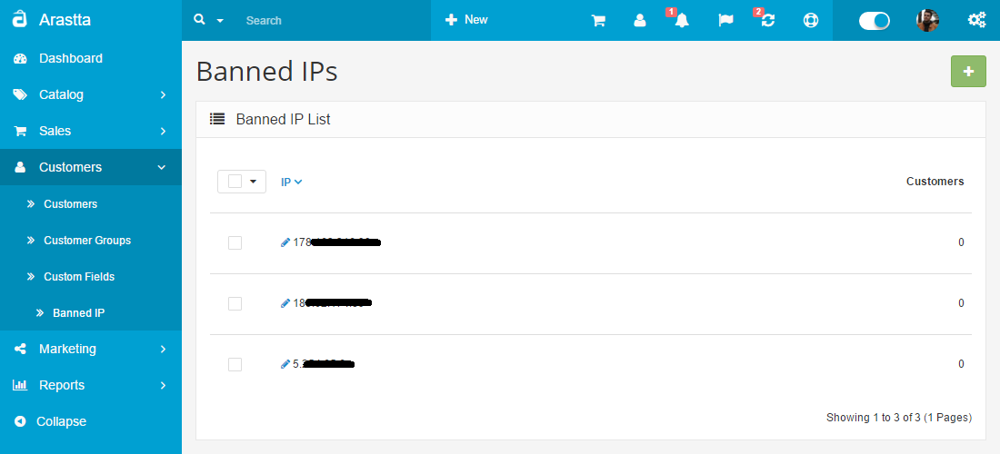

Banned IPs
==========

   You can switch between Basic and Advanced modes from the tabs below.

<ul class="uk-tab" data-uk-tab="{connect:'#doc-tabs', animation: 'fade'}">
    <li><a href="">Basic Mode</a></li>
    <li><a href="">Advanced Mode</a></li>
</ul>

Arastta provides a feature called "**Banned IPs**" that will ban an IP address from logging into the store. This step may become necessary if the shop is being harassed by a fraudulent "customer". If you are experiencing harassment from a particular person, their IP address can be copied from the customer list under **Customers > Customers**. Copy that IP address and go to **Customers > Banned IP**. Click the "**Add New**" button and paste in the IP address to ban a customer from the store. This will stop users of this IP address from logging into the store again.

<ul id="doc-tabs" class="uk-switcher uk-margin">
    <li markdown="1">

### Using Bulk Actions

Bulk Actions describe the process to be performed on particular Banned IPs. These Actions can be performed on one, or more Banned IPs, at one time, if those Banned IPs have been previously selected. Bulk Actions are available, when appropriate, as choices in the Actions pulldown box, above each Table. There is only one Bulk Action allowed, the **Delete**.</li>
    <li markdown="1"></li>
</ul>
