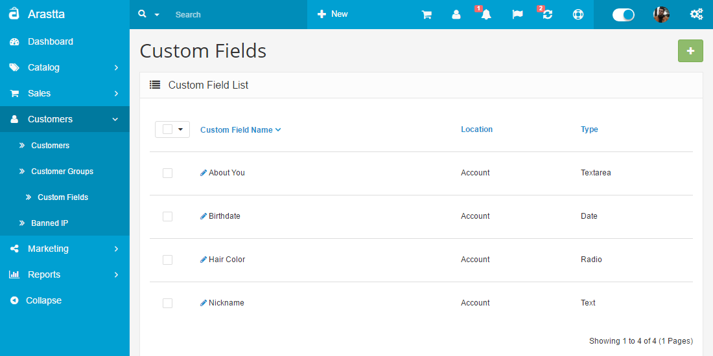
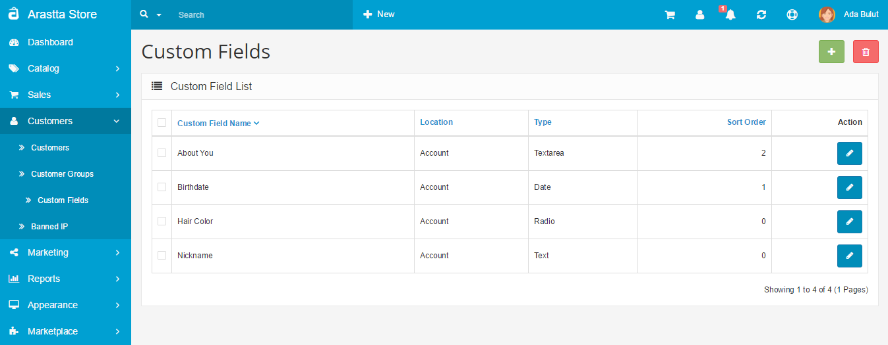
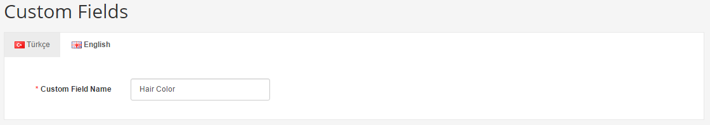
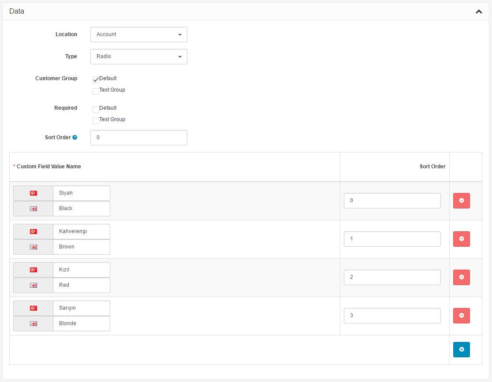
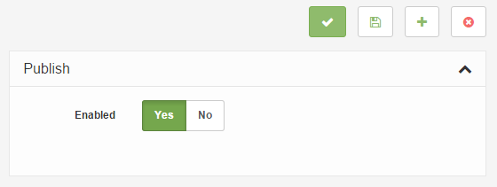
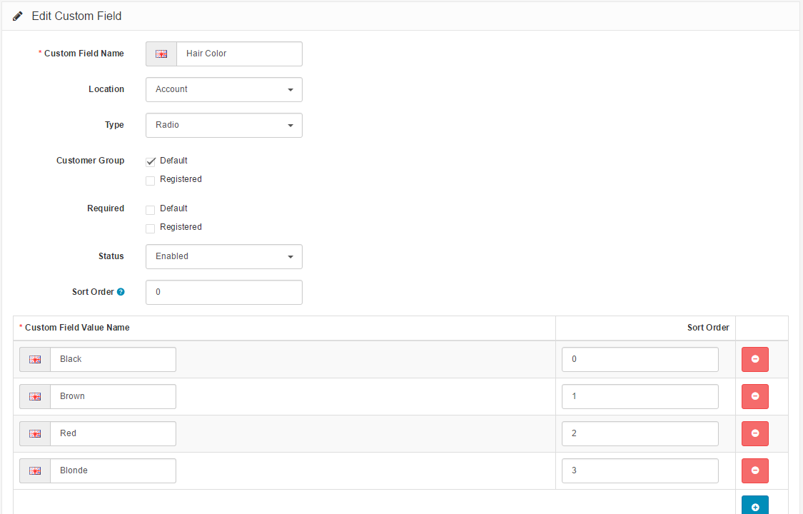

Custom Fields
===============

   You can switch between Basic and Advanced modes from the tabs below.

<ul class="uk-tab" data-uk-tab="{connect:'#doc-tabs', animation: 'fade'}">
    <li><a href="">Basic Mode</a></li>
    <li><a href="">Advanced Mode</a></li>
</ul>

This feature provides creating custom fields for customers on account and address pages. These fields can be categorized by the Location, it means the Account or Address page, and [Customer Groups](docs/user-manual/customers/groups). In a word, when we create a new custom field we can set it for only 1 (one) group or a few groups or all of them. 

<ul id="doc-tabs" class="uk-switcher uk-margin">
    <li>

### Using Bulk Actions

Bulk Actions describe the process to be performed on particular Custom Fields. These Actions can be performed on one, or more Custom Fields, at one time, if those Custom Fields have been previously selected. Bulk Actions are available, when appropriate, as choices in the Actions pulldown box, above each Table. There is only one Bulk Action allowed, the **Delete**.</li>
    <li></li>
</ul>

Essentially, the fields can be created to fit whatever added specifications are needed for the customer. The "**Add New**" button will direct you towards creating a new field.

Field are divided into 4 types. The "Type" dropbox will show a variety of ways to display this field:

- **Choose**: Select, Radio, Checkbox
- **Input**: Text", Textarea
- **File**: File"
- **Date**: Date, Time, Date & Time

<ul id="doc-tabs" class="uk-switcher uk-margin">
    <li>

</li>
    <li></li>
</ul>

Here you can see a front-end example of "My Account" page. First 4 fields are custom fields, **Nickname**, **Birthdate**, **About You** and **Hair Color**.

