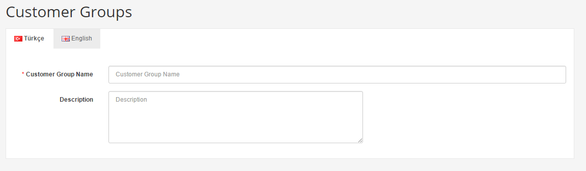
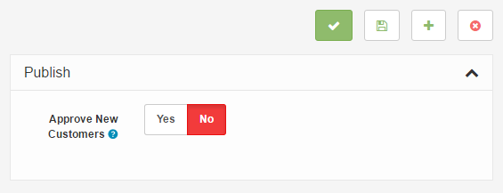

Customer Groups
===============

   You can switch between Basic and Advanced modes from the tabs below.

<ul class="uk-tab" data-uk-tab="{connect:'#doc-tabs', animation: 'fade'}">
    <li><a href="">Basic Mode</a></li>
    <li><a href="">Advanced Mode</a></li>
</ul>

Customer Groups provide a greater organizational scheme for the customer list. This is helpful in selecting customer groups for discounted products and specials in the store; and for sending out emails to select customers.

<ul id="doc-tabs" class="uk-switcher uk-margin">
    <li markdown="1">

### Using Bulk Actions

Bulk Actions describe the process to be performed on particular Customer Groups. These Actions can be performed on one, or more Customer Groups, at one time, if those Customer Groups have been previously selected. Bulk Actions are available, when appropriate, as choices in the Actions pulldown box, above each Table. There is only one Bulk Action allowed, the **Delete**.</li>
    <li></li>
</ul>

### Adding a new customer group

The default customer group for Arastta is called "**Default**". To create a new customer group name, go to the **Sales > Customers > Customer Groups** page. Above the list, click the "**Add New**" button. You will be directed to a page where you can fill in information about the customer group. You can provide a "Customer Group Name" and a "Description" for the group. Within this group, you can approve or disapprove customers logins into their store account. There is also an option to allow the customer to select their company no. or Tax ID. The sorting number determines the position of this group among other customer groups.

<ul id="doc-tabs" class="uk-switcher uk-margin">
    <li markdown="1">

</li>
    <li markdown="1"></li>
</ul>

### Adding a customer group to a customer

In order to apply a customer group to a group of customers, each customer must be individually added to the group under **Sales > Customers**. To add a customer group, select the customer and click "Edit" under "Action". In the General tab there is a drop down selection for "**Customer Group**". Select the customer group and click "Save" at the top right corner.

<ul id="doc-tabs" class="uk-switcher uk-margin">
    <li></li>
    <li markdown="1">### Applying discounts for customer groups to products

In order to add a discounted price of a product to a particular customer group, the product information needs to be edited beforehand. Under **Catalog > Products**, find the product in the list and click "Edit" under "Action". A customer group can be selected under "**Discount**" or "**Special**" tabs. A discounted price needs to be specified, as well as the date start/end to this discount/special. See [Products ](docs/user-manual/catalog/products/overview/)for more information.

</li>
</ul>
