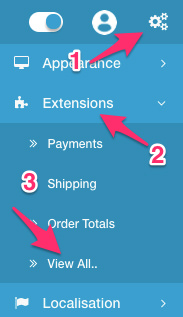
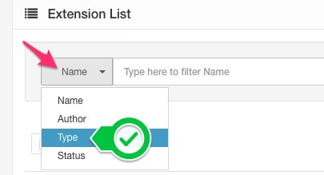

Analytics
========

   You can switch between Basic and Advanced modes from the tabs below.

<ul class="uk-tab" data-uk-tab="{connect:'#doc-tabs', animation: 'fade'}">
    <li><a href="">Basic Mode</a></li>
    <li><a href="">Advanced Mode</a></li>
</ul>

Until Arastta 1.5 version, there was only Google Analytics support in the core. Since 1.5 version, Google Analytics support is removed and a new extension type is added separately which includes **Google Analytics** and **Woopra** out of the box. Also, 3rd part developers can easily add new Analytic extensions.

Integration
----------------

To integrate your desired Analytics account into your Arastta store, navigate to **Extensions** > **View All...** menu from the right menu of your admin panel (you can open right menu by clicking on the cogs icon located in the top right of the page).

All available extensions will be listed on the page and you can look for analytics extensions in this list. An easy way to find analytics extensions specifically is to filtering the extensions. To filter analytics extensions, first, choose **Type** from the filter area at the top of the page.

Then you can click in the search field, a dropdown list will be opened which lists all available extension types and choose **Analytics**. The page will be refreshed and all analytics extensions will be displayed in the list.

Edit your desired Analytics extension to complete the integration.
