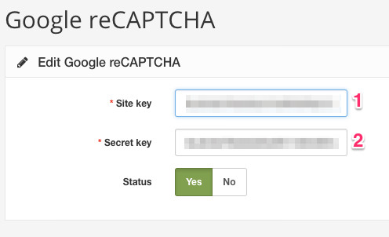

Captcha
========

Until Arastta 1.5 version, there was only Google ReCaptcha support by default. Since 1.5 version, Google ReCaptcha support is removed but a new global extension type is added separately which includes **Google ReCaptcha** and **Basic Captcha** out of the box. Thanks to this extension type, 3rd part developers can easily add new captcha extensions.

Integration
----------------

To integrate your desired captcha service into your Arastta store, navigate to **Extensions** > **View All...** menu from the right menu of your admin panel (you can open right menu by clicking on the cogs icon located in the top right of the page).

All available extensions will be listed on the page and you can look for captcha extensions in this list. An easy way to find captcha extensions specifically is to filtering the extensions. To filter captcha extensions, first, choose **Type** from the filter area at the top of the page.

Then you can click in the search field, a dropdown list will be opened which lists all available extension types and choose **Captcha**. The page will be refreshed and all captcha extensions will be displayed in the list.

Edit your desired Captcha extension to complete the integration.

Basic Captcha Settings
----------------------

Basic Captcha has only **Enable**/**Disable** option in the extension detail page. You can enable it to use on your store, thus it will be available in the captcha list of your store settings.

Google ReCaptcha
----------------

You can click on this extension to edit its details. There are 3 options available: **Site Key**, **Secret Key** and **Status**.

If you don't have a Google ReCaptcha account or don't know how to get it, please refer to [Google's documentation](https://developers.google.com/recaptcha/intro).
