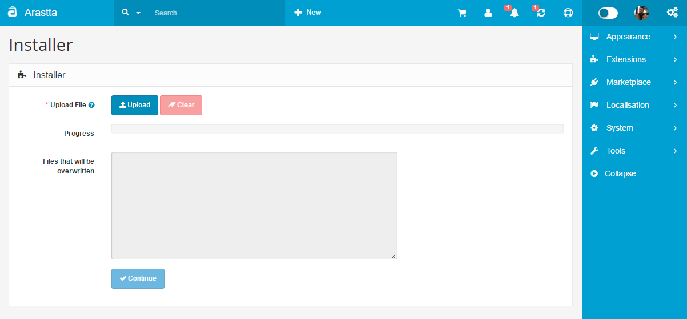

Extension Installer
=============

Just upload the ZIP file from the **Extensions > Extension Installer** page. The ZIP file must contain an "upload" folder with the files to be uploaded. The installer does also show the files that will be overwritten, in case there is any, before it runs the extension.

You can get more info on [Modifications](docs/user-manual/extensions/modifications) page about installing extensions.

