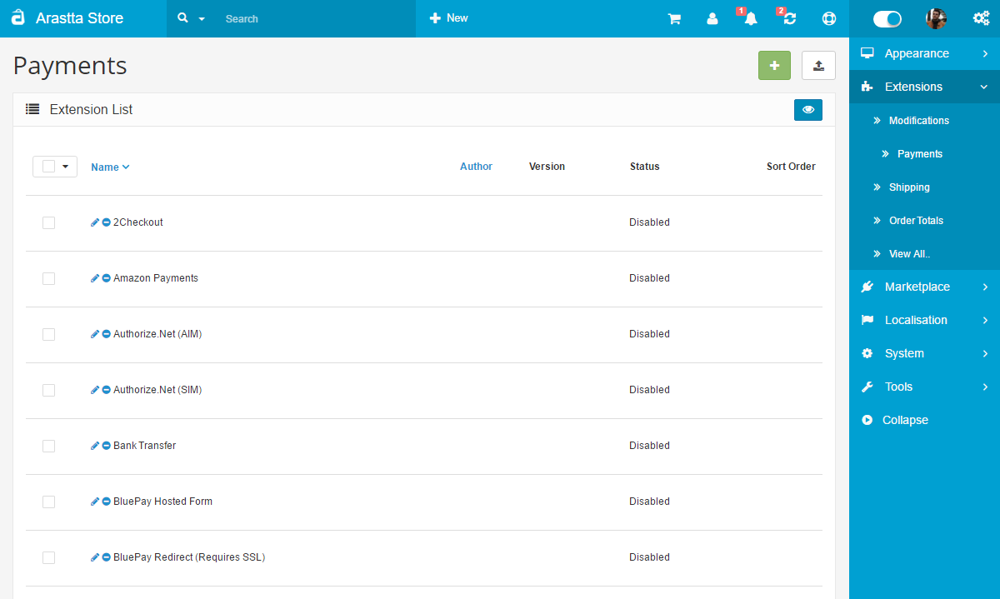

Payments
========

Core payment methods
--------------------

   You can switch between Basic and Advanced modes from the tabs below.

<ul class="uk-tab" data-uk-tab="{connect:'#doc-tabs', animation: 'fade'}">
    <li><a href="">Basic Mode</a></li>
    <li><a href="">Advanced Mode</a></li>
</ul>

The Payments methods extensions can accessed under **Extensions > Payments**. The Arastta package offers a variety of payment methods, from bank transfers to online payment gateways. The following core payment methods are available with an Arastta installation:

- Bank Transfer
- Cash On Delivery
- Free Checkout
- PayPal Payments Standard

And these are **free** Payment extensions provided from **Arastta Core** team:

- 2Checkout
- Amazon Checkout
- Authorize.Net (AIM - SIM)
- BluePay (Hosted - Redirect)
- Cheque / Money Order
- First Data
- Klarna (Account - Invoice)
- LIQPAY
- NOCHEX
- Paymate
- PayPal Express
- PayPal Payflow Pro
- PayPal Payment Pro
- PayPoint
- Payza
- Perpetual Payments
- Realex (Redirect - Remote)
- SagePay (Direct & SERVER)
- Sage Payment Solutions (US)
- Web Payment Software
- WorldPay

<ul id="doc-tabs" class="uk-switcher uk-margin">
    <li></li>
    <li></li>
</ul>

Additional payment methods can be downloaded from the Arastta [Extension Directory.](http://extensions.arastta.pro/payment-gateways)

<ul id="doc-tabs" class="uk-switcher uk-margin">
    <li>Using Bulk Actions
--------------------

Bulk Actions describe the process to be performed on particular Payment methods. These Actions can be performed on one, or more Payment methods, at one time, if those Payment methods have been previously selected. Bulk Actions are available, when appropriate, as choices in the Actions pulldown box, above each Table. There are two Bulk Actions allowed, **Enable** and **Disable**.</li>
    <li></li>
</ul>

Editing a payment method
------------------------

Editing payment methods in the administration for different transaction processors, like Paypal, will require a previously created account. The account and payment information should be obtained from these companies prior to editing the payment method in the administration. You will need to create an account with these companies to use their transaction processing for Arastta. The information required for each payment method will be displayed in the Edit section. Across payment methods, there are a few details that are consistently asked for:

- **Order Status**: a default status of an order once the payment module has completed. Pending is considered one of the best default statuses because it gives the administrator some leeway to process the order.
- **Status**: Disables or enables the payment method.
- **Sort Order**: the position of the payment method in the store front when listed among all the available payment methods.

Payment method in the checkout
------------------------------

Enabling a payment method in the administration will make it available in the Checkout. In Step 5 of the checkout, the customer will be given a radio type selection to select their preferred payment method.

Payment method in order history
-------------------------------

After the customer has confirmed the order, they can visit their Order History in their Account page to view its status. Immediately after checkout, the status will display the default order status you selected when editing the payment method details. In the screenshot below, you may chose "Pending" as the order status.

The screenshot below shows "Pending" as the order status in the customer's Order History page under "My Account" in the store front.

### Support

To receive support for payment extensions, please visit the [Payment Extension section](forum/categories/listings/extensions) of the support forum.
