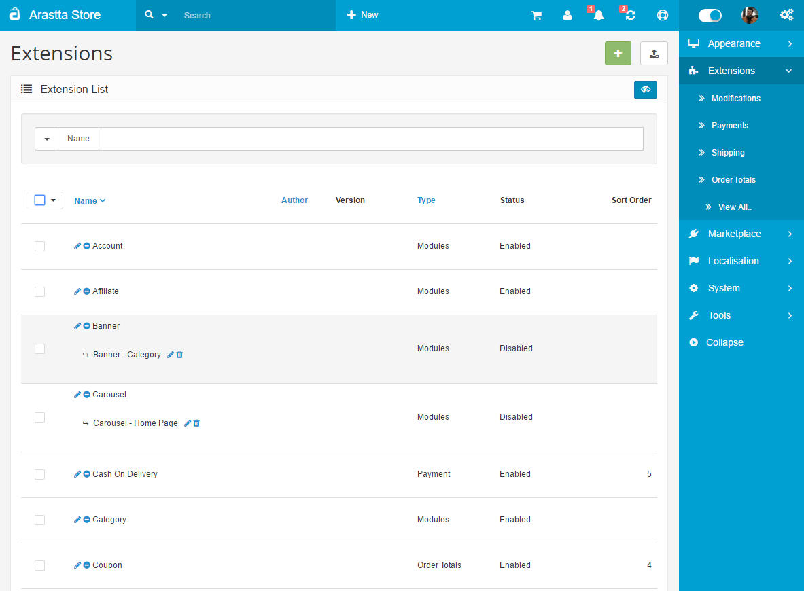
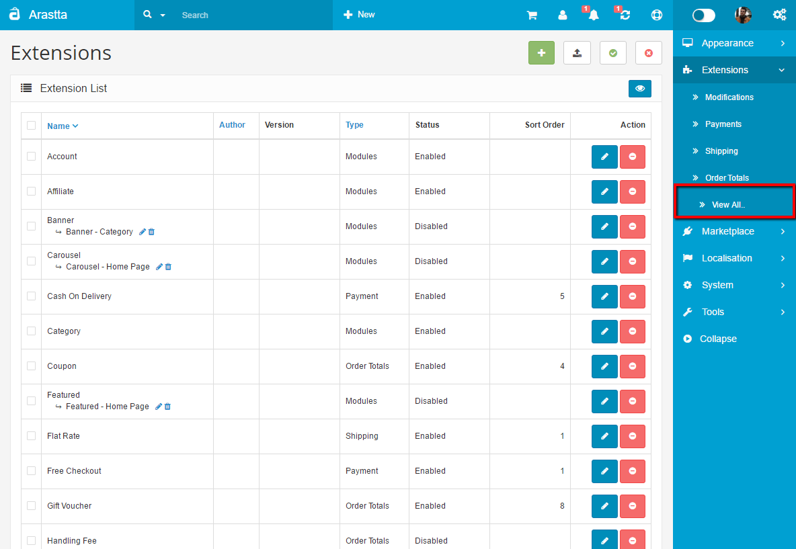

View All..
========

All Extension List
----------

   You can switch between Basic and Advanced modes from the tabs below.

<ul class="uk-tab" data-uk-tab="{connect:'#doc-tabs', animation: 'fade'}">
    <li><a href="">Basic Mode</a></li>
    <li><a href="">Advanced Mode</a></li>
</ul>

This section contains all extensions in a list. All types of extensions like Payments, Shipping, Modules, Order Totals, Feeds, Editors, Captcha, and other uncategorized extensions will be listed here in this page.

* You can directly go to **Extension Installer** page and upload extensions. Also you can use the "Add New" button and it will redirect you to **Marketplace > Extensions** section for installing free extensions or purchase any extension without leaving marketplace, just purchase and install them on your Arastta site instantly.

Additional extensions can also be downloaded to the store from [Extension Directory](http://extensions.arastta.pro/).

<ul id="doc-tabs" class="uk-switcher uk-margin">
    <li markdown="1">

Using Bulk Actions
--------------------

Bulk Actions describe the process to be performed on particular extensions. These Actions can be performed on one, or more extensions, at one time, if those extensions have been previously selected. Bulk Actions are available, when appropriate, as choices in the Actions pulldown box, above each Table. There are two Bulk Actions allowed, **Enable** and **Disable**.</li>
    <li markdown="1"></li>
</ul>
