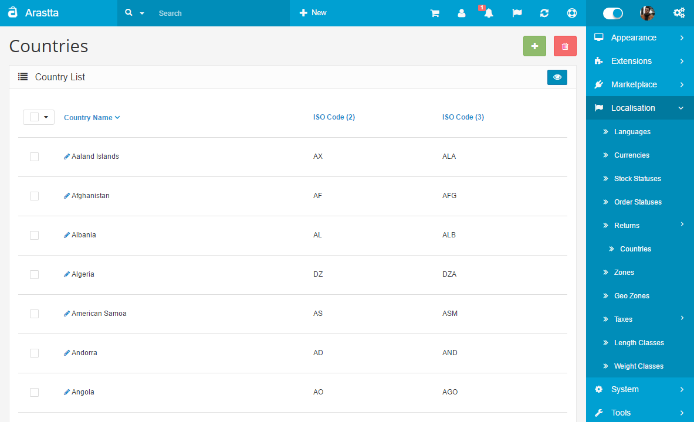
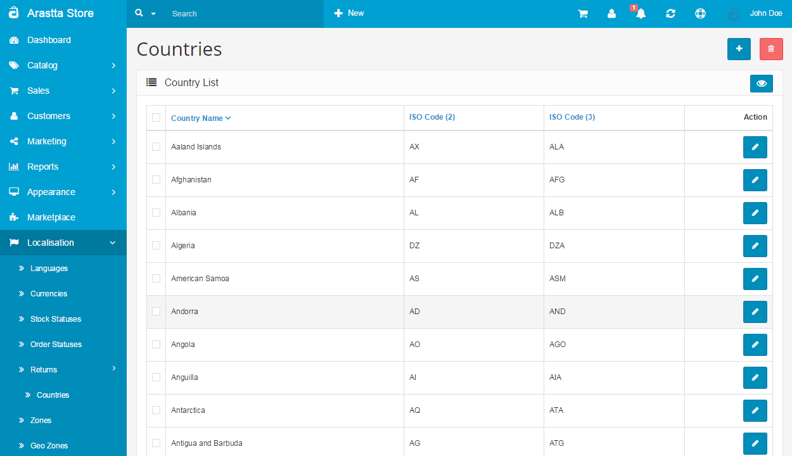

Countries
=========

   You can switch between Basic and Advanced modes from the tabs below.

<ul class="uk-tab" data-uk-tab="{connect:'#doc-tabs', animation: 'fade'}">
    <li><a href="">Basic Mode</a></li>
    <li><a href="">Advanced Mode</a></li>
</ul>

253 countries are stored in the Country section with the Arastta installation. These countries can be used to estimate shipping and taxes when a customer enters in their location. Each country can be individually disabled, removing them from the store front, by editing them. The countries can be deleted as well. The only issue with deletion of a country is that the country information will be deleted with it. If you wanted to make that country available for shipping, you would have to re-enter the country's information; whereas enabling a disabled country is easier.

<ul id="doc-tabs" class="uk-switcher uk-margin">
    <li markdown="1"></li>
    <li markdown="1"></li>
</ul>
