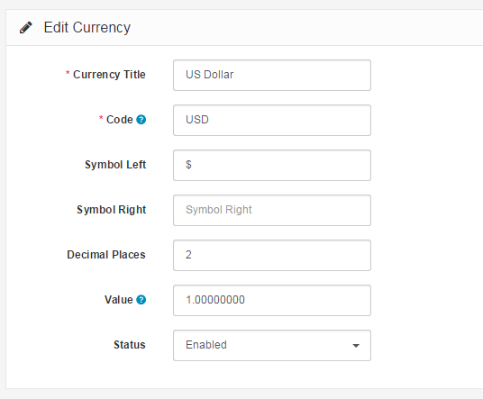

Currencies
==========

The currency sections lets you select which currencies are available for use in store front. The default currency will display all the product prices in that currency. The currency preference can be changed by the customer in the header section of any page in the front office.

In the store below, we have enabled the Euro, Pound, and US Dollar.

The following information is needed about a currency to add it to your store:

- **Currency Title**
- **Code:** The ISO code for the currency. Currency codes can be looked up at this [currency converter](http://www.oanda.com/currency/?srccont=rightnav).
- **Symbol Left:** Adds a currency symbol to the left of the code.
- **Symbol Right: **Adds a currency symbol to the right of the code.
- **Decimal Places: **The amount of decimal places displayed in the price of the store front.
- **Value:** The Default currency will be set to a value of 1. Every value of currency will be relative to this value. Since the US Dollar is 1.0 (the default), the Euro is tabulated to .81 for the value based on its worth. When Arastta transitions between currencies in the store front, it will use the value number to calculate the prices of products in that new currency. Arastta will update the currency values in the Local Tab under store settings if Auto Update Currency is enabled. Visit [Settings ](docs/user-manual/system/settings/local)for more information.
- **Status:** Enables or disables the currency in the store front.

