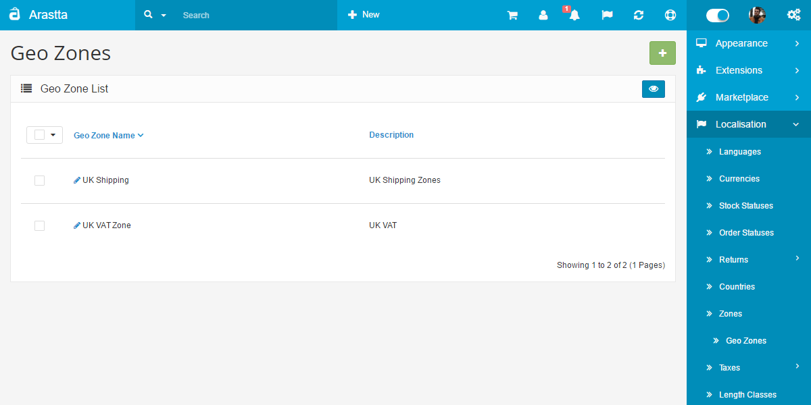
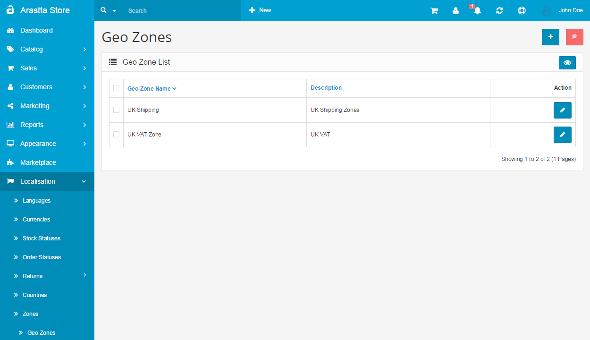

Geo Zones
=========

   You can switch between Basic and Advanced modes from the tabs below.

<ul class="uk-tab" data-uk-tab="{connect:'#doc-tabs', animation: 'fade'}">
    <li><a href="">Basic Mode</a></li>
    <li><a href="">Advanced Mode</a></li>
</ul>

Geo zones are customized zones used in calculating shipping and taxes. Multiple countries and zones can be added to one geo zone to customize shipping methods.

The geo zone below is used to combine the west cost states of the United States into one zone. The west coast of the US consists of California, Oregon, and Washington states. Each individual state is added by selecting the Country, Zone, then clicking "Add Geo Zone".

<ul id="doc-tabs" class="uk-switcher uk-margin">
    <li markdown="1"></li>
    <li markdown="1">/li>
</ul>

See [Shipping](docs/user-manual/extensions/shipping) for more information on how geo zones are used.
