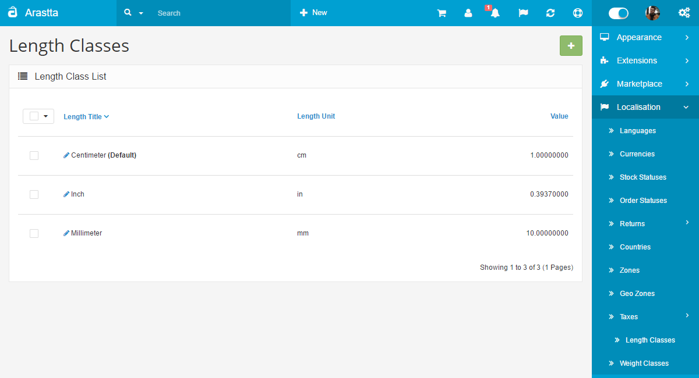
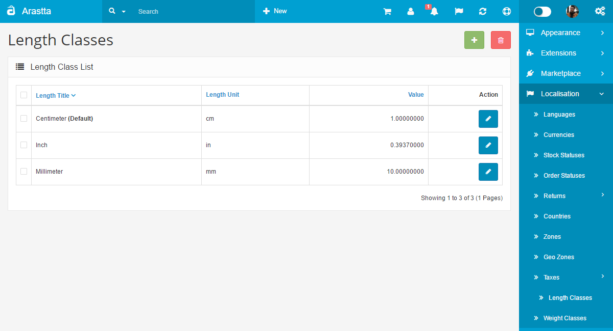

Length Classes
==============

   You can switch between Basic and Advanced modes from the tabs below.

<ul class="uk-tab" data-uk-tab="{connect:'#doc-tabs', animation: 'fade'}">
    <li><a href="">Basic Mode</a></li>
    <li><a href="">Advanced Mode</a></li>
</ul>

Length classes are used to assign length specifications to products in the [Data tab](docs/user-manual/catalog/products/data). The values added to products will be displayed in the product page in the store front. The following information is required to create a new length class:

- **Length title**: The name of the length measurement, (i.e. Centimeter)
- **Length unit**: The units of measurement (i.e. cm)
- **Value**: Set 1 for the default value. Every value added to other lengths, such as km, will need to be relative to that. There are 10 mm in one 1cm, so the value of mm would be set to 10.

<ul id="doc-tabs" class="uk-switcher uk-margin">
    <li></li>
    <li></li>
</ul>
