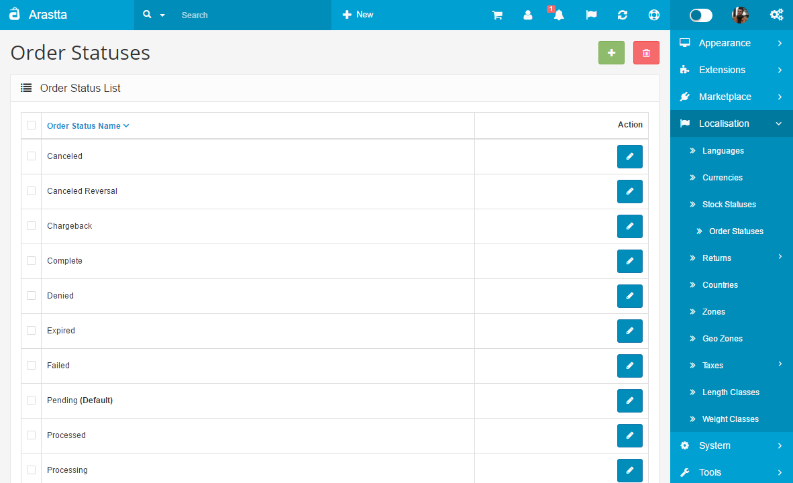

Order statuses
==============

   You can switch between Basic and Advanced modes from the tabs below.

<ul class="uk-tab" data-uk-tab="{connect:'#doc-tabs', animation: 'fade'}">
    <li><a href="">Basic Mode</a></li>
    <li><a href="">Advanced Mode</a></li>
</ul>

Similar to the stock status, when an order is confirmed by the customer they will need to see an order status. The order status can be accessed from their account page in the store front. After the order status names are created, they can be selected under [Orders](docs/user-manual/extensions/order-totals).

<ul id="doc-tabs" class="uk-switcher uk-margin">
    <li></li>
    <li></li>
</ul>
