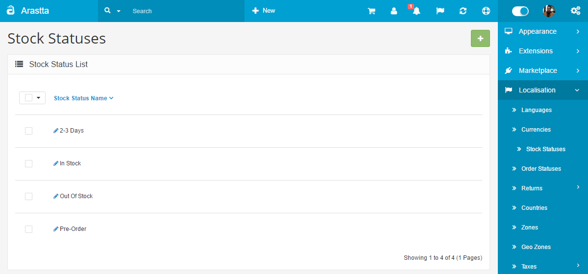
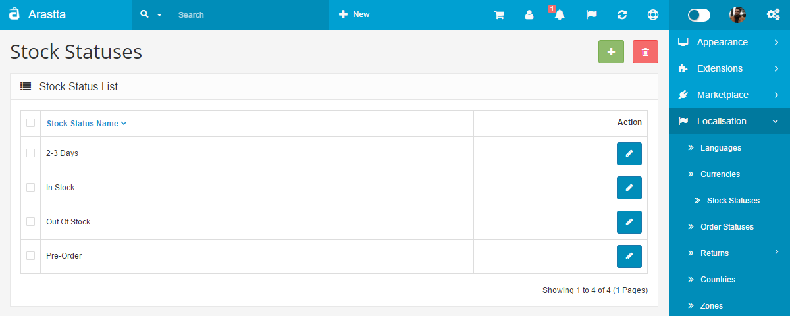
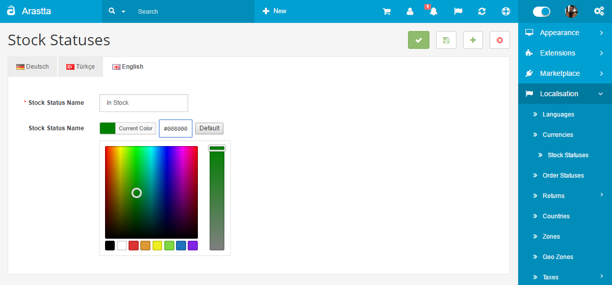
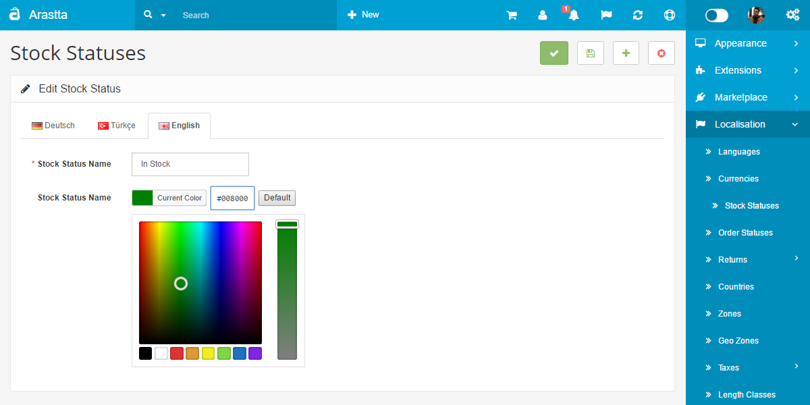
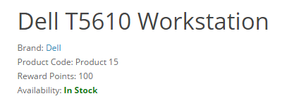

Stock Statuses
==============

   You can switch between Basic and Advanced modes from the tabs below.

<ul class="uk-tab" data-uk-tab="{connect:'#doc-tabs', animation: 'fade'}">
    <li><a href="">Basic Mode</a></li>
    <li><a href="">Advanced Mode</a></li>
</ul>

In this section you may create **Out of Stock** statuses to be displayed on the product page when a product is out of stock. The stock status name is arbitrary.

The default stock status for **Out of Stock** products can be edited under the option tab in [Settings](docs/user-manual/system/settings/option). The specific **Out of Stock Status** for a product can be edited in the **Data** tab in [Products](docs/user-manual/catalog/products/data).

<ul id="doc-tabs" class="uk-switcher uk-margin">
    <li></li>
    <li></li>
</ul>

##Styling on stock status

This feature comes with Arastta 1.2.0 version. It allows you to set different colors for each status.

<ul id="doc-tabs" class="uk-switcher uk-margin">
    <li></li>
    <li></li>
</ul>

