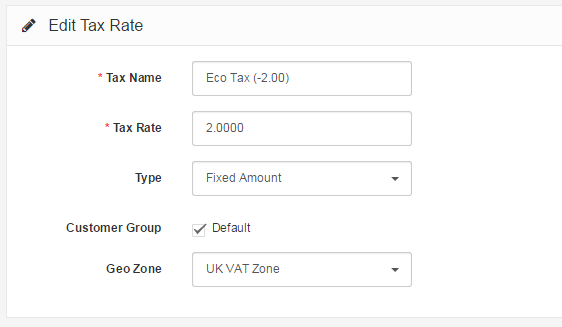

Taxes
=====

The Taxes section in Localisation allows the administrator to create the taxes that will be applied to specific products in the store.

### Tax rates

The tax rate will be used to calculate the taxes from an order. The following information is needed to save a tax rate to the administration:

- **Tax Name**: A name for the tax that will be displayed in the store front when taxes are added to order total.
- **Tax Rate**: A number value for the tax.
- **Type**: Determines whether the number value in Tax Rate is a fixed amount or a percentage of the total amount of an order.
- **Customer Group**: Selecting a customer group will add this tax to all the customers within this group. Multiple customer groups can be selected at once.
- **Geo Zone**: Selecting a Geo Zone will apply the tax to the regions and countries within a Geo Zone.

### Tax class

Tax classes can store multiple tax rates into one category. The taxes can be customized to calculate the taxes based on the payment address (customer) or the store's address. Tax classes require the following information:

- **Tax Class Title**
- **Description**
- **Tax Rate**: selecting "Add Rule" will add a tax rate that was created in Tax Rates. Base On requires either the payment address or the store address to be selected. This will determine the amount of tax added to the shopping cart total in the store front. Priority determines the position of the tax rate if other tax rates are listed with it.

The tax class must be added to each product individually in order to apply tax rates for a purchase. The tax class field is located under the Data tab in Products. See Products for more information.
