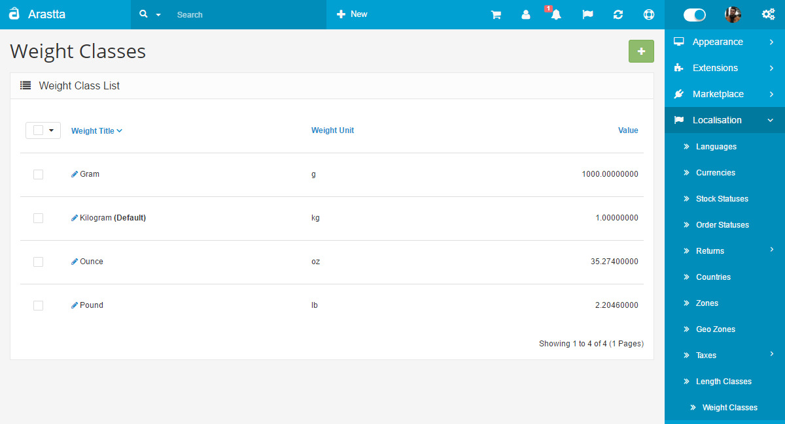
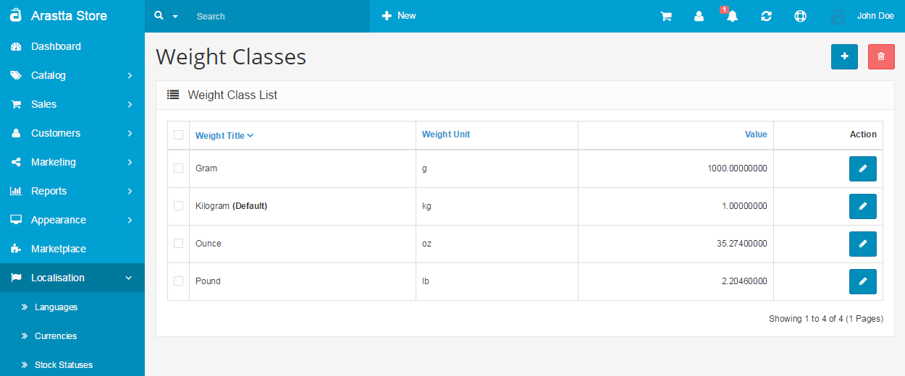

Weight Classes
==============

   You can switch between Basic and Advanced modes from the tabs below.

<ul class="uk-tab" data-uk-tab="{connect:'#doc-tabs', animation: 'fade'}">
    <li><a href="">Basic Mode</a></li>
    <li><a href="">Advanced Mode</a></li>
</ul>

Similar to length classes, weight classes are used to assign weight specifications to products in the [Data tab](docs/user-manual/catalog/products/data). The following information is required to create a new weight class:

- **Weight title**: The name of the weight measurement (i.e. Kilogram)
- **Weight unit**: The unites of measurement (i.e. kg)
- **Value**: Set 1 for the default value.Every value added to other weights, such as g, will need to be relative to that value. There are 1000 g in 1 kg, so the value of g would be set to 1000.

<ul id="doc-tabs" class="uk-switcher uk-margin">
    <li markdown="1"></li>
    <li markdown="1"></li>
</ul>
