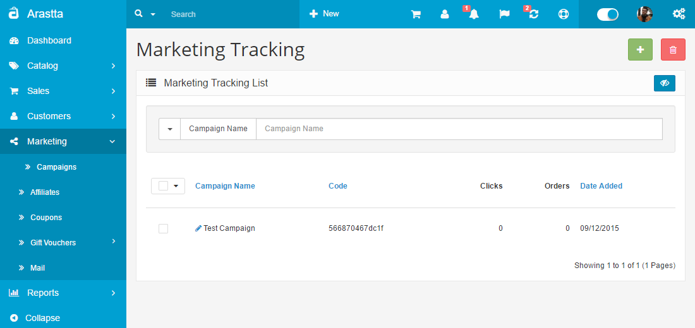
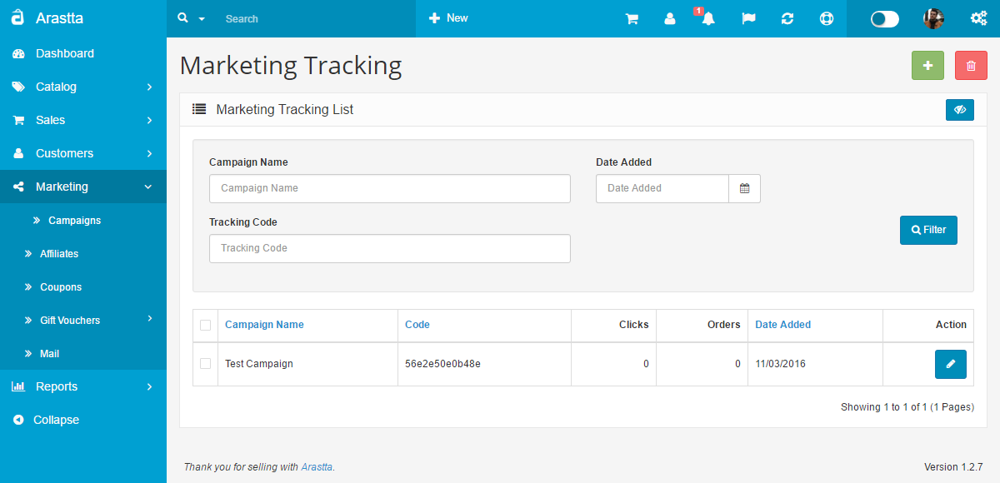
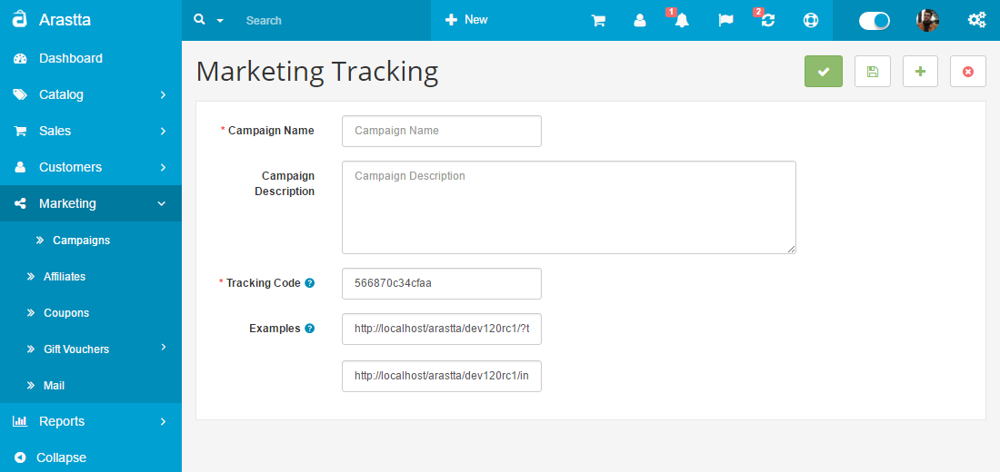

Campaigns
=========

Marketing Tracking
--------------

   You can switch between Basic and Advanced modes from the tabs below.

<ul class="uk-tab" data-uk-tab="{connect:'#doc-tabs', animation: 'fade'}">
    <li><a href="">Basic Mode</a></li>
    <li><a href="">Advanced Mode</a></li>
</ul>

Arastta has a build-in module for creating tracking links for your marketing campaigns. Tracking links are links to your store which include a special tracking code. Any visit via your tracking links will be recorded in the Arastta admin dashboard so you can monitor your marketing campaigns traffic and conversion rate.
 
To create your first marketing tracking link, please login your Arastta admin dashboard and refer to the Marketing section via the main navigation menu.

<ul id="doc-tabs" class="uk-switcher uk-margin">
    <li markdown="1">

### Using Bulk Actions

Bulk Actions describe the process to be performed on particular Tracking Campaigns. These Actions can be performed on one, or more Tracking Campaigns, at one time, if those Tracking Campaigns have been previously selected. Bulk Actions are available, when appropriate, as choices in the Actions pull down box, above each Table. There is only one Bulk Action allowed, the **Delete**.</li>
    <li markdown="1"></li>
</ul>

From the Marketing Tracking List page click on the Add icon to proceed with the configuration of your tracking link. Here you need to configure several settings to create your link:
 
**Campaign Name:** Just any name to help you recognize the campaign for which your tracking code is created.

**Campaign Description:** Any internal note to help you distinguish your tracking link from the rest of your campaigns' links.

**Tracking Code:** This can be any random generated string. This string will be added to the end of your URL links.

<ul id="doc-tabs" class="uk-switcher uk-margin">
    <li markdown="1"></li>
    <li markdown="1"></li>
</ul>

### Tracking Codes

To track your campaigns, the tracking code is added to the end of the URL leading to each marketing campaign. You can embed the code into each of the links you chose in your website.

When you are creating a banner for an advertising campaign in your website or another online media platform, you have to create a new marketing campaign. The new campaign will be used to track how many clicks you get and where they came from by embedding the tracking code in the link to the campaign.

**Example.** You start advertising in three different media platforms. You will need to add a new marketing campaign for each of them, with the name of each media platform you are advertising on. That way, you will track how many clicks you get from each of their websites. You simply give them the link with the embedded tracking code of each marketing campaign.

Last, you can copy the example of your tracking links. For example, if you would like to point a link to your Arastta home page and track the referrals and orders via it, you may use:

> `http://mydomain.com/?tracking=ID`

or point to a specific page or product using the full URL to it and add the tracking tag and ID like this:

> `http://mydomain.com/index.php?route=common/home&tracking=ID`

Make sure you replace 'mydomain.com' with your actual domain name and the 'ID' with your campaign tracking code unique tracking code ID.
