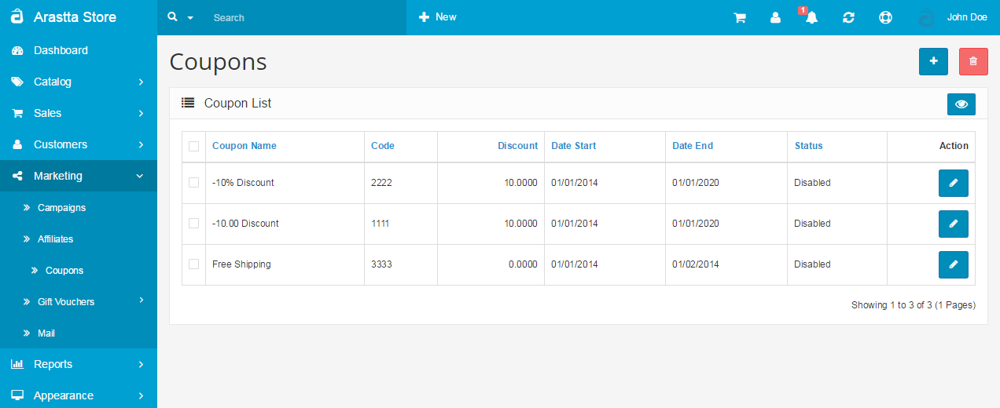
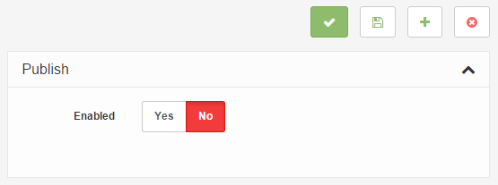
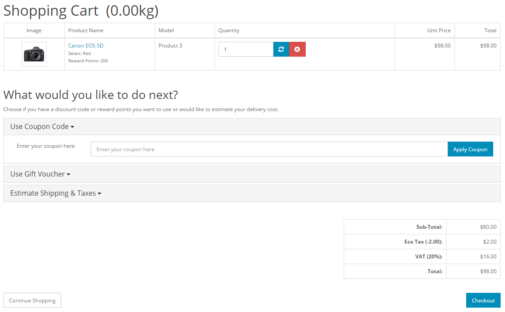
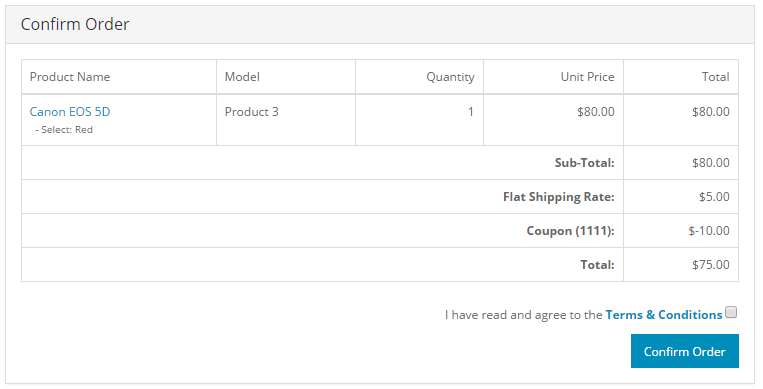

Coupons
=======

   You can switch between Basic and Advanced modes from the tabs below.

<ul class="uk-tab" data-uk-tab="{connect:'#doc-tabs', animation: 'fade'}">
    <li><a href="">Basic Mode</a></li>
    <li><a href="">Advanced Mode</a></li>
</ul>

You may create and designate coupons to specific products or product categories under **Marketing > Coupons**. The Coupons page will display a list of all the coupons created in the administration.

<ul id="doc-tabs" class="uk-switcher uk-margin">
    <li>

### Using Bulk Actions

Bulk Actions describe the process to be performed on particular Coupons. These Actions can be performed on one, or more Coupons, at one time, if those Coupons have been previously selected. Bulk Actions are available, when appropriate, as choices in the Actions pulldown box, above each Table. There is only one Bulk Action allowed, the **Delete**.</li>
    <li></li>
</ul>

### General tab

Editing or inserting a coupon will lead the administrator to a form containing the following fields:

- **Coupon Name**: A descriptive name for the coupon.
- **Code: **A code that the customer needs to enter in the shopping cart to use the coupon in the store front.
- **Type: **The discount can be a fixed amount off, or a percentage off from the total amount.
- **Discount: **The number taken off from the purchase total.
- **Total Amount: **The amount a customer must reach before using the coupon.
- **Customer Login: **Selecting 'yes' requires the customer to be logged into their store account to use the coupon. Selecting 'no' will let a customer use the coupon as a guest.
- **Free Shipping: **Selecting 'yes' gives the customer free shipping for using the discount code.
- **Products: **Individual products can be selected by entering in the product name in the space provided. To remove a product from the discount, click the red minus button in the product list below it.
- **Category: **Selecting a product category will apply the discount to all products within that category. See [Categories](docs/user-manual/catalog/categories/overview) for more information on how to create a new product category.
- **Date Start: **The first day that the discount can be used.
- **Date End: **The last day the discount can be used.
- **Uses per Coupon:** Limits how many times the coupon can be used by customers.
- **Uses per Customer: **Limits how many times a specific customer can use the coupon.
- **Status: **Enables or disables the coupon for use in the store front.

<ul id="doc-tabs" class="uk-switcher uk-margin">
    <li>

</li>
    <li></li>
</ul>

From the information in the General Tab above, we can see that this coupon gives the customer a $10 discount to the Acer Aspire product.

### Coupon history

The Coupon History tab list all the uses of this coupon in the store. The following information about each use will be displayed:

- OrderID
- Customer
- DateAdded
- Amount

Coupons in the store front
--------------------------

Adding and editing coupons in the administration affect the use of coupons in the Shopping Cart and Checkout in the store front.

Shopping cart
-------------

To enable the use of Coupons in the store front, the coupon extension must be enabled by you under the [Order Totals](docs/user-manual/marketplace/order-totals) extension. For the customer to use the "-10.00 Discount" coupon, they must first add the product to their cart from the product page, then enter the code in the Shopping Cart. They can select "**Use Coupon Code**", enter the coupon code in the space provided, then add "**Apply Coupon**".

Applying the coupon will subtract the coupon discount from the original total. A newly discounted total will be shown under the Coupon(code) total in the order totals section.

Checkout
--------

The customer will see the coupon discount once more in the Confirm Order step in Checkout:

