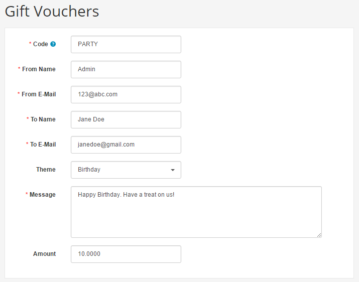
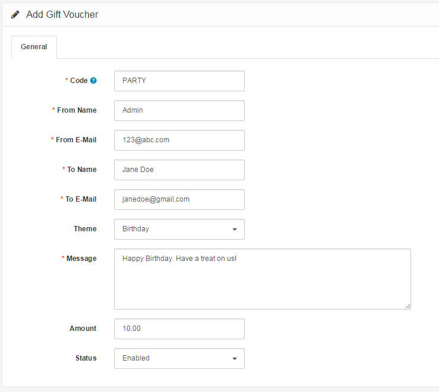
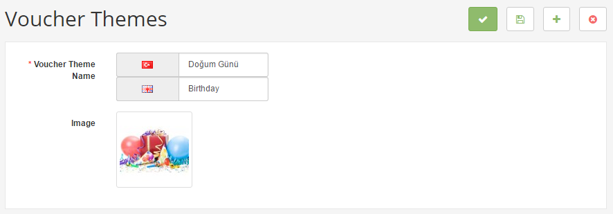
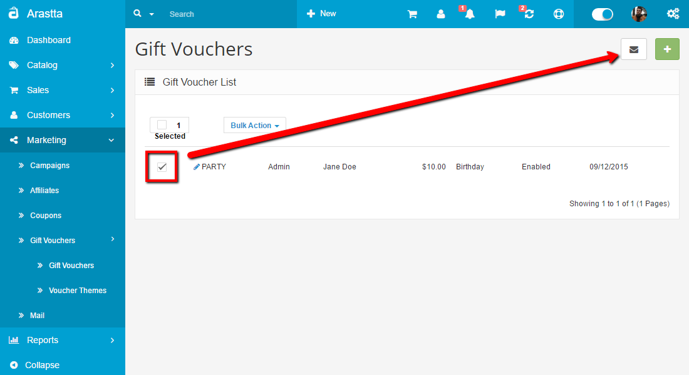
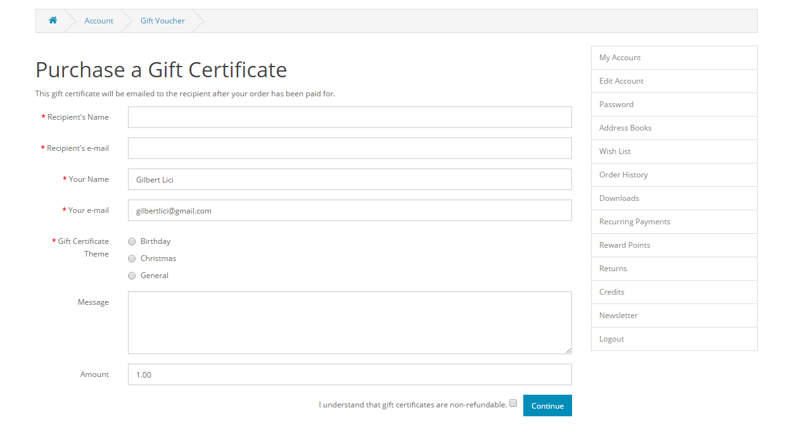

Gift Vouchers
=============

Gift vouchers can be individually sent to customers through their email by other customers in the store front. The customer receiving the gift certificate can use the code provided in the email at the shopping cart to deduct the gift voucher amount from the order total. To manage the Gift Vouchers of the store, go to **Marketing > Gift Vouchers > Gift Vouchers**.

<i class="uk-icon-info-circle"></i> Gift Vouchers only have one use per customer. If the customer uses the same code for another order, Arastta will display the warning "Warning: Gift Voucher is either invalid or the balance has been used up!"

<ul id="doc-tabs" class="uk-switcher uk-margin">
    <li>### Using Bulk Actions

Bulk Actions describe the process to be performed on particular Gift Vouchers. These Actions can be performed on one, or more Gift Vouchers, at one time, if those Gift Vouchers have been previously selected. Bulk Actions are available, when appropriate, as choices in the Actions pulldown box, above each Table. There is only one Bulk Action allowed, the **Delete**.</li>
    <li></li>
</ul>

General tab
-----------

To create a new gift voucher, click "**Add New**". The following information will be needed:

- **Code**: The code the customer must enter in the Shopping Cart to use the gift voucher.
- **From Name**: The name of the person sending the gift certificate.
- **From E-Mail**: The email of the person sending the gift certificate.
- **To Name**: The name of the person receiving the gift certificate.
- **To E-Mail**: The email of the person receiving the gift certificate.
- **Theme**: The theme of the gift voucher email.
- **Message**: A message added in the gift voucher email.
- **Amount**: The amount of the gift certificate to be used in the store.
- **Status**: Enables or disables the gift voucher.

<ul id="doc-tabs" class="uk-switcher uk-margin">
    <li></li>
    <li></li>
</ul>

Voucher history tab
-------------------

The voucher history tab displays the use of the gift voucher code in the checkout. The Order ID, Customer Name, Amount, and Date Added will be displayed.

Voucher themes
--------------

The Voucher Themes section alters the image displayed in the email according to the theme. In the store front, customers purchasing the voucher for a person can choose a theme for voucher.

<ul id="doc-tabs" class="uk-switcher uk-margin">
    <li></li>
    <li></li>
</ul>

Emailing a gift voucher to a customer
-------------------------------------

Once a gift voucher has been created, you are responsible for sending out the email to the customer receiving the gift voucher. After you make sure the customer's email information has been filled out in the General Tab, you can send the email by clicking "Send" under "Action". If the email was sent, Arastta will display the message: "**Success: Gift Voucher e-mail has been sent!**".

<ul id="doc-tabs" class="uk-switcher uk-margin">
    <li></li>
    <li></li>
</ul>

The screenshot below is how the customer will view the Gift Voucher email in their email:

The Code, From Name, Message, Amount fields from the General Tab are included in the content of the email. The Birthday Theme selected above is shown in the email by the image on the right side.

Purchasing a gift voucher in the store front
--------------------------------------------

Customers have the option to buy a gift voucher for their friends and family. They can purchase a gift certificate by accessing **My Account > Gift Voucher** from their account page, or through **Extras > Gift Voucher** in the footer section of any page.

The information added in the fields above will be automatically stored in the administration, once a customer confirms the purchase of the gift voucher. The minimum and maximum amounts a voucher can be purchased for is controlled under the store's settings. See [Settings ](docs/user-manual/system/settings/option)for more information.
