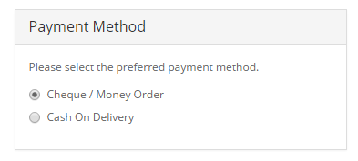

Payments
========

Core payment methods
--------------------

The Arastta package offers a variety of payment methods, from bank transfers to online payment gateways. The following core payment methods are available with an Arastta installation:

- AlertPay
- Authorize.Net (AIM)
- Bank Transfer
- Cheque / Money Order
- Cash On Delivery
- Free Checkout
- LIQPAY
- Moneybookers
- NOCHEX
- Paymate
- PayPoint
- Perpetual Payments
- PayPal Website Payment Pro
- PayPal Website Payment Pro (UK)
- PayPal Standard
- SagePay
- SagePay Direct
- SagePay (US)
- 2Checkout
- Web Payment Software
- WorldPay

Additional payment methods can be downloaded from the Arastta [Extension Directory.](http://extensions.arastta.pro/payment-gateways)

Editing a payment method
------------------------

Editing payment methods in the administration for different transaction processors, like Paypal, will require a previously created account. The account and payment information should be obtained from these companies prior to editing the payment method in the administration. You will need to create an account with these companies to use their transaction processing for Arastta. The information required for each payment method will be displayed in the Edit section. Across payment methods, there are a few details that are consistently asked for:

- **Order Status**: a default status of an order once the payment module has completed. Pending is considered one of the best default statuses because it gives the administrator some leeway to process the order.
- **Status**: Disables or enables the payment method.
- **Sort Order**: the position of the payment method in the store front when listed among all the available payment methods.

Payment method in the checkout
------------------------------

Enabling a payment method in the administration will make it available in the Checkout. In Step 5 of the checkout, the customer will be given a radio type selection to select their preferred payment method.

Payment method in order history
-------------------------------

After the customer has confirmed the order, they can visit their Order History in their Account page to view its status. Immediately after checkout, the status will display the default order status you selected when editing the payment method details. In the screenshot below, you may chose "Pending" as the order status.

The screenshot below shows "Pending" as the order status in the customer's Order History page under "My Account" in the store front.

### Support

To receive support for payment extensions, please visit the [Payment Extension section](forum/categories/listings/extensions) of the support forum.
