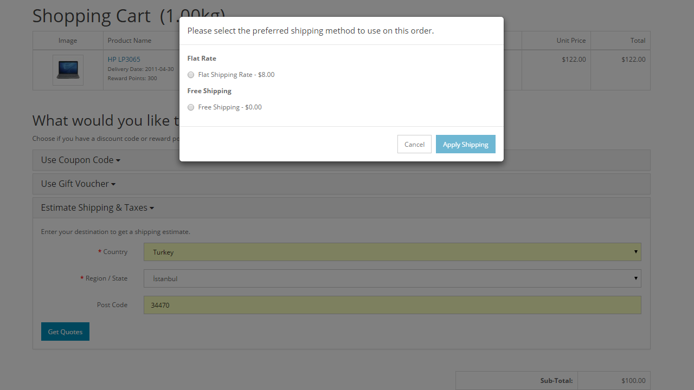

Shipping
========

The shipping methods extensions can accessed under Marketplace > Shipping. The core shipping methods seen below are included with the Arastta package.

The shipping methods need to be installed before they can be enabled or disabled for the store. To Install a shipping method, click "Install" under "Action". Once the shipping method is installed, you can edit the specifications of that shipping method, or uninstall it to remove the shipping method information.

Editing the shipping method
---------------------------

Each shipping method needs to be individually edited to meet your shop's shipping requirements and to specify the prices for that service. There are a few details that are present across all shipping methods:

- **Geo Zone**: the geographical zone that this shipping method is available to. The GeoZone can be created or configured at System > Localisation > GeoZone in the administration. For more information visit [Localisation](docs/user-manual/localisation/geo-zones).
- **Status**: The status determines whether the shipping method will be available in the store front.
- **Sort Order**: The sort order affects the placement of the shipping method among other available shipping methods. A shipping method with a sort order of 1 will be positioned above another shipping method with a sorting order of 2 in the store front.

Shipping methods in the store front
-----------------------------------

Editing shipping methods in the administration will affect the shipping methods available to customers in both the store front Shopping Cart and Checkout pages.

### Shopping cart

The shopping cart has a special feature called "Estimate Shipping & Taxes" that will calculate a shipping payment for a customer's order. See [Order totals](docs/user-manual/marketplace/order-totals) to enable or disable this feature. When a customer enters their regional information, a popup window will ask the customer to select a shipping method. In this window, every shipping method that is enabled under Shipping Methods will be listed according to their sorting order. The store below enabled Free Shipping and Flat Shipping Rates as their two available shipping methods.

After the customer applies the shipping, the shipping method and it's cost will be displayed under the Totals.

### Checkout

In Step 4 of the Checkout, the customer will need to select a shipping method before finalizing their purchase. The Delivery Method will display every shipping method that was enabled in the administration. The store in the screenshot below enabled the Free Shipping and Flat rate shipping methods. The shipping methods were positioned according to their sorting order, with their prices included on the right side.

### Support

To receive support for the Shipping extensions, visit the [Shipping Extension](forum/categories/listings/extensions) section of the support forum.
