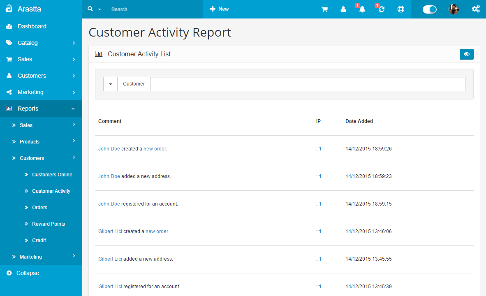
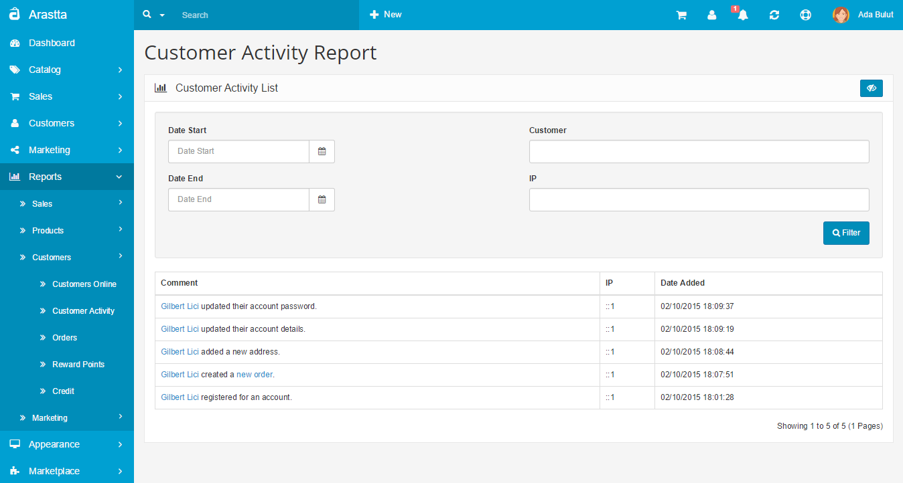

Customer Activity Report
======================

   You can switch between Basic and Advanced modes from the tabs below.

<ul class="uk-tab" data-uk-tab="{connect:'#doc-tabs', animation: 'fade'}">
    <li><a href="">Basic Mode</a></li>
    <li><a href="">Advanced Mode</a></li>
</ul>

The Customer Activity Report shows a list of all activities of customers in the store front. You can access this section under **Reports > Customers > Customer Activity** in the administration side.

The report will position the latest activity first. It will record everything about the customer activities starting with his/her registered day in the store. A direct link will be added when the customer make a new order, so this will make easier to reach up to the order.

The customer activity report displays the following information:

- **Comment:** The activity type of the customer.
- **IP**: The customer's IP.
- **Date Added**: The date of the activity.

<ul id="doc-tabs" class="uk-switcher uk-margin">
    <li markdown="1"></li>
    <li markdown="1"></li>
</ul>
