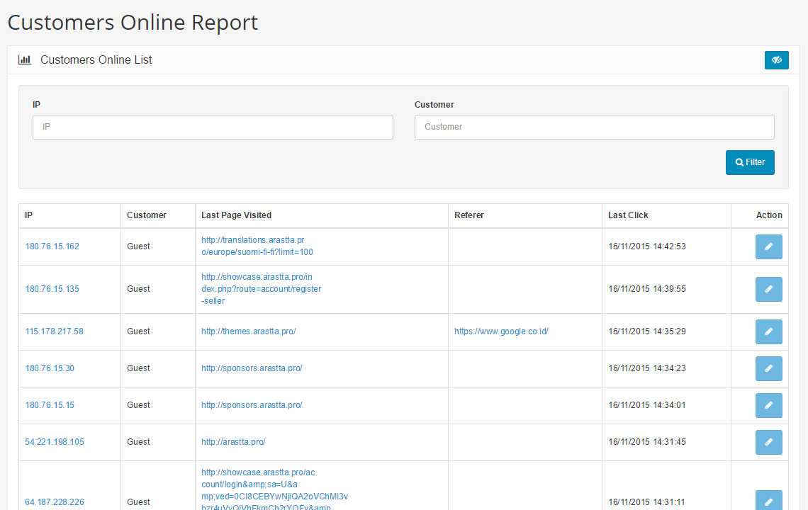

Customers Online Report
======================

   You can switch between Basic and Advanced modes from the tabs below.

<ul class="uk-tab" data-uk-tab="{connect:'#doc-tabs', animation: 'fade'}">
    <li><a href="">Basic Mode</a></li>
    <li><a href="">Advanced Mode</a></li>
</ul>

The Customers Online Report shows a list of the last activities of online customers in the store front. You can access this section under **Reports > Customers > Customers Online** in the administration side.

The report will position the latest activity first. The user will be tracked even if he/she is not yet registered in your store, and will be named as Guest. It will record his/her IP, the last page has visited, the reference page that came to your store, and the last click date & time.

The customers online report displays the following information:

- **IP**: The customer's IP.
- **Customer:** The users' name or Guest.
- **Last Page Visited**: The last page visited by user/guest.
- **Referer**: The reference page.
- **Last Click**: The last click date & time activity.

<ul id="doc-tabs" class="uk-switcher uk-margin">
    <li></li>
    <li></li>
</ul>
