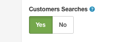

Customer Search Reports
=======================

If you wonder what is searched on your site by your customers, you can learn it by navigating to **Reports** > **Customers** > **Search** section and see what terms are searched on your site by your customers.

Please note that, _this report type only records searchs made by a logged-in customers_. Other searches made by guests (not logged-in visitors) will not be recorded.

How to enable Search reports
----------------------------

By default, tracking the search data is not enabled on Arastta. You need to activate this feature if you want to track the searches. You can navigate to `System > Settings` page and open **Option** tab.

There, you need to choose **Yes** for `Customers Searches`option.

