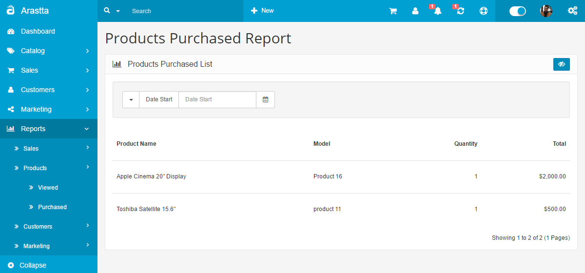

Products Purchased Report
=========================

   You can switch between Basic and Advanced modes from the tabs below.

<ul class="uk-tab" data-uk-tab="{connect:'#doc-tabs', animation: 'fade'}">
    <li><a href="">Basic Mode</a></li>
    <li><a href="">Advanced Mode</a></li>
</ul>

The Products Purchased Report can be found under **Reports > Products > Purchased**. The report will display the all the products purchased from the store. The products are positioned according to the total amount of money acquired for that product: the highest at the top and lowest at the bottom.

<ul id="doc-tabs" class="uk-switcher uk-margin">
    <li markdown="1"></li>
    <li markdown="1"></li>
</ul>

The Filter button lets you customize which products are shown on the list. Selecting a date start and date end will only show the products purchased between those two dates. Selecting an order status will display the all the products purchased within a status, such as Pending or Completed.
