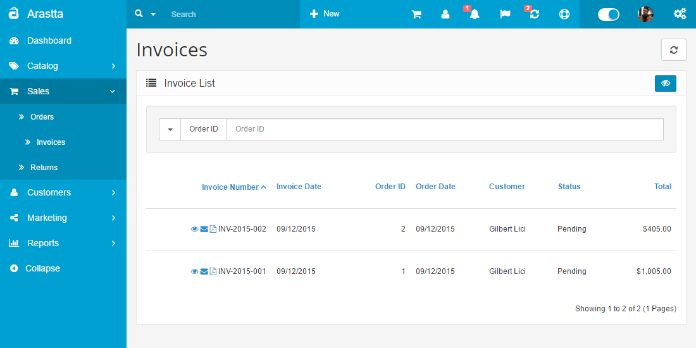
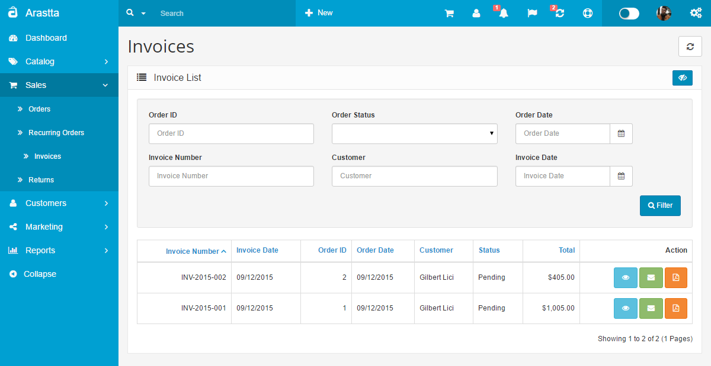
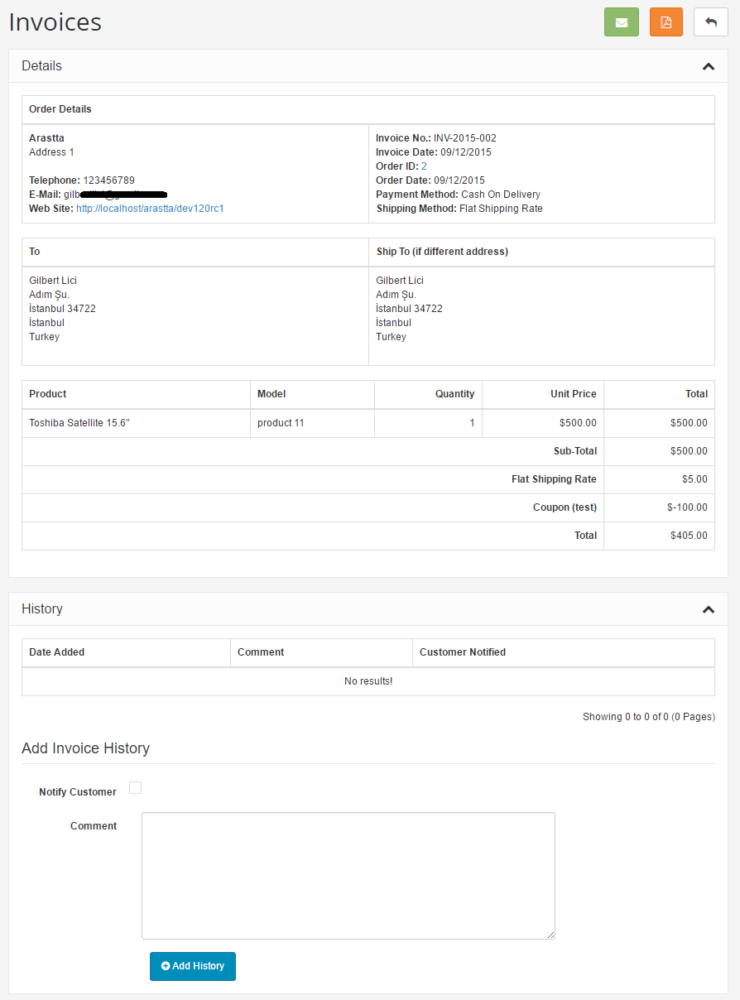
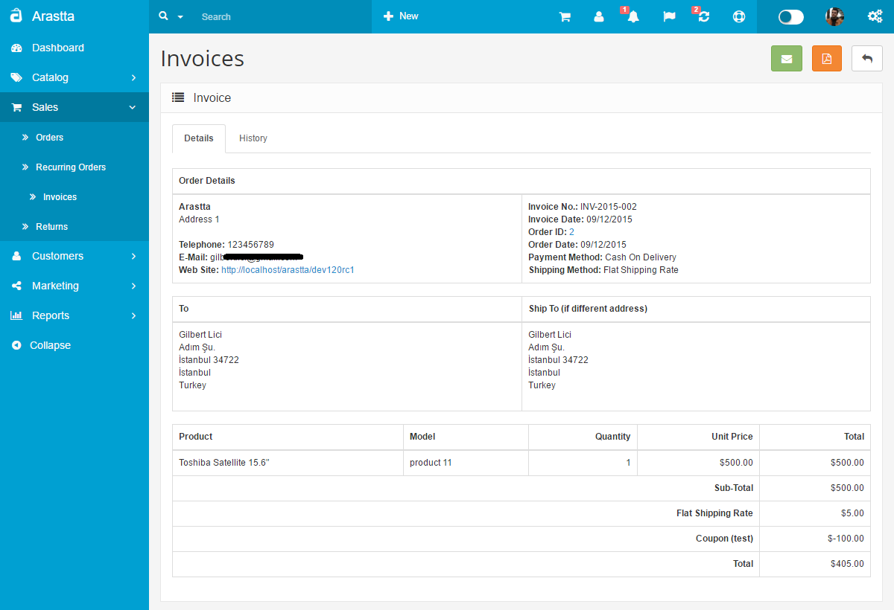
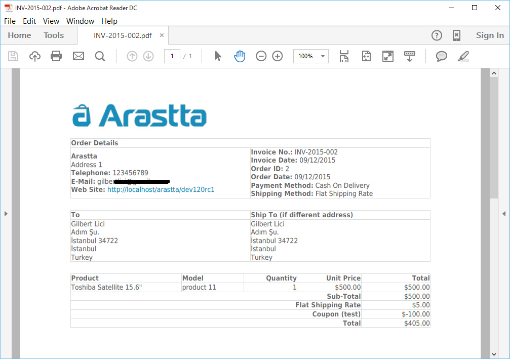

Invoices
=======

Invoice management
---------------------

   You can switch between Basic and Advanced modes from the tabs below.

<ul class="uk-tab" data-uk-tab="{connect:'#doc-tabs', animation: 'fade'}">
    <li><a href="">Basic Mode</a></li>
    <li><a href="">Advanced Mode</a></li>
</ul>

The Invoices section is located under **Sales > Invoices**. On this page, every invoice ever made from the store is listed in detail.

The following details are displayed for each return on the list:

- **Invoice ID**: a number assigned to an invoice by Arastta during the invoice confirmation.
- **Invoice Date**: the date when the invoice is created.
- **Order ID**: a number assigned to an order by Arastta during the checkout confirmation.
- **Status**: update of the status of the invoice. After the invoice is initially created the status will be "Pending". The default options are Missing Orders, Canceled, Canceled Reversal, Chargeback, Complete, Denied, Expired, Failed, Pending, Processed, Processing, Refunded, Reversed, Shipped, and Voided.
- **Total**: the total price of the order.

<ul id="doc-tabs" class="uk-switcher uk-margin">
    <li markdown="1"></li>
    <li markdown="1"></li>
</ul>

Generating Invoices
-------------------

The Invoices section under **Sales > Invoices** lets you manage merchandise invoices. Generating invoices is so easy. You can generate new invoices by using the "**Generate**" button in the right corner above the invoices list.

### Invoice details

The following screenshot shows the details page of an invoice:

<ul id="doc-tabs" class="uk-switcher uk-margin">
    <li markdown="1"></li>
    <li markdown="1"></li>
</ul>

PDF Invoices
-----------------

As an online store owner you should be aware of the importance and necessity of an efficient invoicing system and management in your eCommerce solution. So we have implemented PDF Invoice feature and from now on you and your customers can manage and download the invoices as PDF files.

<ul id="doc-tabs" class="uk-switcher uk-margin">
    <li markdown="1">Go to the Invoices page under **Sales > Invoices**. Near the invoice number field of each invoice is the "**Download PDF**" icon. This action will download a PDF file including details of the selected order.</li>
    <li markdown="1">Go to the Invoices page under **Sales > Invoices**. Under the action field of each invoice is the "**Download PDF**" button. This action will download a PDF file including details of the selected order.</li>
</ul>

