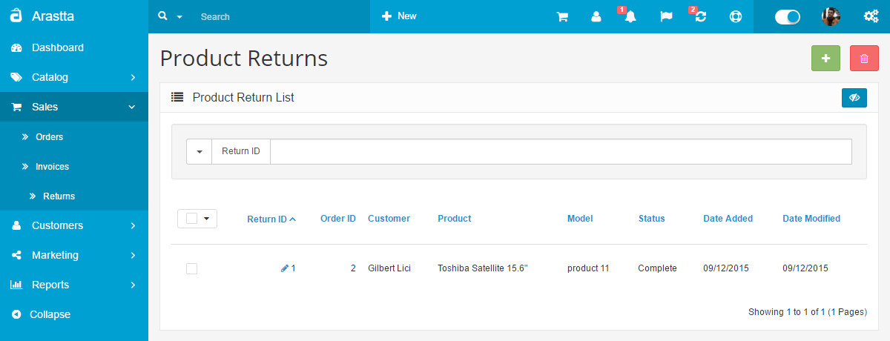
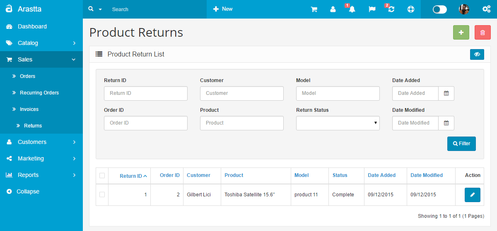
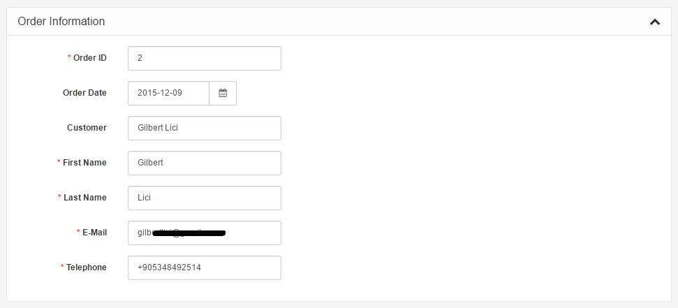
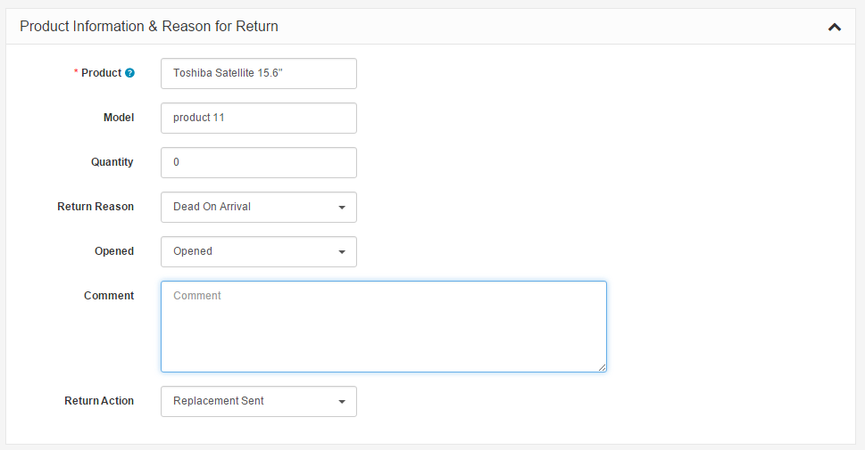
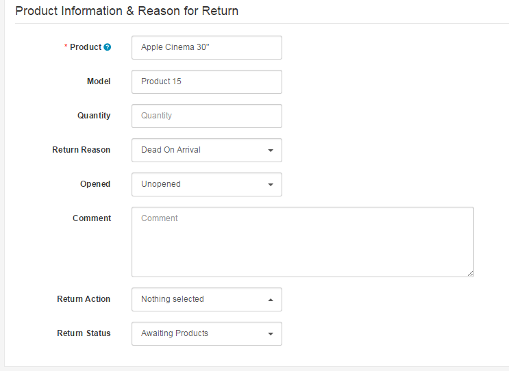

Returns
=======

Viewing Product Returns details
---------------------

   You can switch between Basic and Advanced modes from the tabs below.

<ul class="uk-tab" data-uk-tab="{connect:'#doc-tabs', animation: 'fade'}">
    <li><a href="">Basic Mode</a></li>
    <li><a href="">Advanced Mode</a></li>
</ul>

The Returns section is located under **Sales > Returns**. On this page, every return ever made from the store is listed in detail.

The following details are displayed for each return on the list:

- **Return ID**: a number assigned to a return by Arastta during the return confirmation.
- **Order ID**: a number assigned to an order by Arastta during the checkout confirmation.
- **Customer**: the name of the customer that made the order.
- **Product**: the name of the product for the return.
- **Model**: the model of the product.
- **Status**: update of the status of the return. After the return is initially created the status will be "Pending". The default options are Awaiting Products, Complete, and Pending.
- **Date Added**
- **Date Modified**

<ul id="doc-tabs" class="uk-switcher uk-margin">
    <li markdown="1">

Using Bulk Actions
-----------------------------

Bulk Actions describe the process to be performed on particular Returns. These Actions can be performed on one, or more Returns, at one time, if those Returns have been previously selected. Bulk Actions are available, when appropriate, as choices in the Actions pulldown box, above each Table. There is only one Bulk Action allowed, the **Delete**.</li>
    <li markdown="1"></li>
</ul>

Adding a new return
-------------------

The Return section under **Sales > Returns** lets you manage merchandise returns. You must manually enter the product and return information to create a new return. To insert a new return, click the "**Add New**" button in the right corner above the returns list.

### Return details

Filling in the Returns Details tab is the first step in creating a new return. The following details are required to fill out a return:

- **Order ID**: the ID of the order that was returned.
- **Order Date**: the date that order was made.
- **Customer**
- **First Name**
- **Last Name**
- **E-mail**
- **Telephone**

<ul id="doc-tabs" class="uk-switcher uk-margin">
    <li markdown="1"></li>
    <li markdown="1"></li>
</ul>

### Products

The Products section fills out more information about the product that was returned, and why it was returned. You will need to manually type in the product that the customer returned. Typing in "Apple" will bring up all the apple products in the store. We selected the Apple Cinema 30" from the drop down, and the "Model" space was auto-completed for us. You may also include the quantity, the return reason, whether or not the product was opened, the customer's comments, the return action (credit issued, refunded, replacement sent), and return status (awaiting products, complete, pending). The return status names can be added in the [return statuses](docs/user-manual/localisation/returns) section.

<ul id="doc-tabs" class="uk-switcher uk-margin">
    <li markdown="1"></li>
    <li markdown="1"></li>
</ul>

<i class="uk-icon-info-circle"></i> <b>Update in version 1.2.7 :</b> It will let you select products by searching the Model and Title in <b>Products</b> field. This will be very helpful if you are using same title on different products. See <a href="https://github.com/arastta/arastta/issues/353">Github</a> for more information.

Editing a return
----------------

Merchandise returns are automatically added to the Returns section when submitted by the customer. The Returns form is located in the store front on the Returns page, under Customer Service in the footer.

The information filled out in this form will be saved in **Sales > Returns**. The fields that the customer entered above will be included in the same fields when viewing the return in the administration. You can edit the status of the return to Awaiting Products, Pending, or Completed. When the status is updated in the administration, the customer will be able to view the status of their order under My Account > "View your return requests" in the store front.
