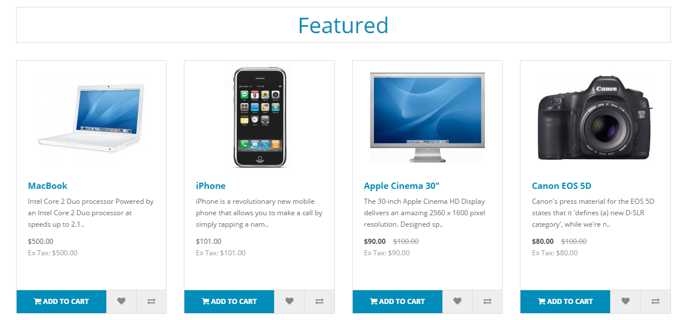
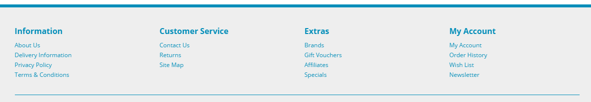
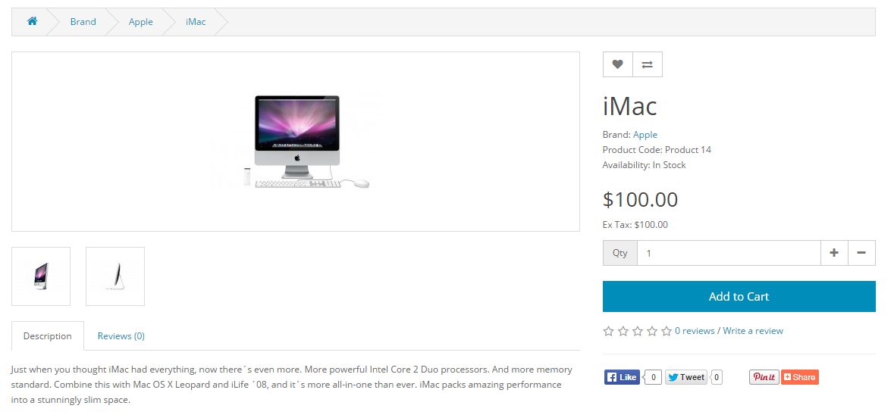
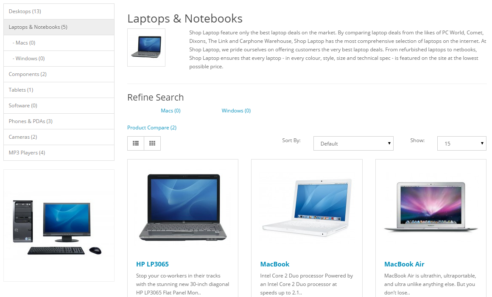

Store Front
===========

Browsing the Store Front
------------------------

This guide is intended to be used as an introduction to the Arastta default store front. The store front reveals how the customer views and interacts with the store.

The default theme
-----------------

Arastta comes with a default theme after a fresh installation:

The products seen above are included as sample data with the Arastta installation. These products can easily be removed and replaced with the shop's products later.

This guide will cover the basics of browsing the store front with the default theme. You can find an ever expanding list of available themes at the Arastta [Extension Directory](http://extensions.arastta.pro/).

Navigating the shop
-------------------

The Arastta default theme makes navigating a shop's products easily accessible to its customers.

### Anatomy of the home page

The home page is arguably the most important page in the shop, in terms of presentation. In most cases, this will be the first page that a customer interacts with (especially if they are directed to the store site from a search engine). The shop's homepage needs to be user-friendly, while at the same time highlighting the shop's products.

The first step in becoming familiar with the store front is understanding the anatomy of the Arastta default homepage.

#### The header

The header will be displayed at the top of the page, on every page of the store; not just the home page.

The header has the following navigation options:

- Store logo: Clicking on this logo will direct the customer back to the home page of the store.
- Currency block: The customer can select which currency the store's products will be in by clicking on any of the currency icons.
- Shopping Cart: Displays the number of items purchased, and the total price of the order. Clicking on the icon will display a drop-down box containing all of products added to the cart and an option to "View Cart" or "Checkout".
- Search box: The customers can type in the search box to search for a product within the store's product categories.
- Welcome text: Welcomes the visitor and gives them an option to "login" or "create an account". When logged in it will display "You are logged in as [first name]" and gives an option to log out.
- Links: Links the customer to the Home page, Wish List, My Account, Shopping Cart, and Checkout.

#### The top menu

The top menu category only displays the top parent categories of products. See [Categories ](docs/user-manual/catalog/categories/overview)for more information on how to create and assign product categories.

Like the header, the top menu will be displayed on every page. When the customer's mouse is dragged over a category, a drop down menu will display the sub-categories for that parent category.

When a parent category is clicked, the customer will be directed to the category page, which displays all the products within that category.

#### Slideshow

The slideshow displays several product banners of your choice by alternating the images in a slideshow. After a certain amount of time, one banner will shift to the the next banner. Banners in this slideshow are useful for highlighting certain products to be easily accessible by the customer. When the banner is clicked on, the customer will be directed to the product on the banner's page.

Unlike the top menu and header, the slideshow in the Arastta default can only be viewed on the home page in this position.

#### Featured products

Arastta gives you the option of featuring specific products of their choosing on the home page.

The Featured section includes the product image, name, price; and an option to add the product directly to the Shopping Cart.

> The carousel is only located on the Home Page in the default.

#### Footer

The footer is located at the bottom of every page, not just the Home Page. This block of miscellaneous links is useful in sorting relevant pages for the customer that may not logically sort anywhere else.

The organizational scheme of the footer can be divided into the following sections:

- **Information:** "About Us", "Delivery Information", "Privacy Policy", "Terms & Conditions"
- **Customer Service:** "Contact Us", "Returns", "Site Map"
- **Extras:** "Brands", "Gift Vouchers", "Affiliates", "Specials"
- **My Account:** "My Account", "Order History", "Wish List", "Newsletter"

### Product pages

The Arastta default product page will follow the structural format seen below (minus header/top menu/footer).

The product page can be divided into the following sections:

- **Categories:** All the products on the shop will be organized into designated categories. The category link block on the left-side of the product page will enable the customer to browse other products by category.
- **Product image:** The product image can be displayed under the title on the left-side, along with alternate views of the product underneath it in smaller box. Clicking on the main image will expand the image within the window for the customer to see it in greater detail.
- **Product details:** The product code, availability, and price are displayed just right to the product image.
- **Cart:** The customer can select a quanity and add the product to their cart, wishlist, or compare.
- **Rating/Sharing:** Underneath the cart can rate the product and/or share the product on different social media websites.
- **Description tab:** An area underneath the main product information to provide a detailed description of the product.
- **Review tab:** An area for the customer to write a review on the product.

#### Category product listings

Category product listings enable customers to browse products similar to other products within the same category. This is especially helpful for customers looking to compare products, a feature that will be explained under [Categories](docs/user-manual/catalog/categories/overview). The category page can be accessed a number of ways. It can be accessed from the top menu, when a customer clicks on one of the parent categories. Also, on product pages a customer can access the category product listing page by clicking on a category on the left side category block.

As seen above, the category block is displayed on the left-side. There is space under the Category title at the top to add a description to the category. The "Refine Search" links to sub-categories of that category for the user to browse. The products can be displayed according to the customer's preference: in a list or grid. The above image is sorted in the listing format. The products can be sorted according to name, price, rating, or model in the "Sort By" box. The number of products displayed in the product listing can be changed in "Show" from 15 up to 100.

There is a section that gives space for each of the products within the category, providing a product image, description, price, and an Add to Cart option. There is an option to add the product to a wish list. Another option for the product is to "Add to Compare".

#### Product compare

The "Add to Compare" feature in the product section allows the customer to compare the different specifications, features, and price of a number of products s/he might be interested in.

The customer is given the option to add one of the compared products to the cart if they want to. Pressing "Continue" will bring the user back to the home page.

### Shopping Cart page

Once a customer adds a product to the cart, they can access the shopping cart in the header under "Shopping Cart".

The shopping cart gives an overview of the product selected by including the categories "Image", "Product Name", "Model", "Quantity", "Unit Price", and "Total". The customer has an option to add a coupon code or gift voucher, or estimate shipping & taxes, before heading to the checkout. The "Continue Shopping" button links back to the homepage.

### Creating an account

Before a customer can continue checking out a product from the shopping cart, the customer needs to select either guest checkout or log into their account. The guest checkout doesn't require log-in details. Returning customers may want to make an account with the store.

There are a few ways a customer can make an account:

**1. Checkout**  

Step 1 of the check out process allows the user to make an account before continuing with payment. Selecting "Register Account" will change Step 2 of checkout from Billing to Account & Billing details. Account & Billing asks for the same personal details as Billing, except that it asks for the user to create a password for their account. After Step 2 is completed, the customer may continue with the checkout process.

**2. Header- "Register"**  

Clicking the "Register" in the header will direct the customer to the "Register an Account" page. The same personal details included in the checkout will need to be filled in here.

**3. Header- "My Account"**  

Clicking "My Account" in the header will direct the customer to the "Account Login" page. This page gives the customer an option to log in if they already have an account, or create a new account. In the "New Customer" section the customer can click "Continue" under Register Account to be directed to the "Register an Account" page.

### Checkout

Once a product has been added to the cart, the customer can continue to the checkout to make their product purchase. The Checkout page can be accessed in the header section of every page (found under the search box). Customer checkout using Arastta is a simple process that can be completed in 6 steps.

1. **Step 1: Checkout options**The customer can log into or register their account (as explained above), or select guest checkout.
2. **Step 2: Billing details**Personal details including "First Name", "Last Name", "E-mail", and "Telephone" are filled into a form. It also requires the customer's address details.
3. **Step 3: Delivery details**In Billing Details, the user can check a box to indicate that the delivery details and billing details are the same. This will cause it to skip over this step to Delivery Method. If the delivery etails are different from the billing details the customer can enter this information in a form in this section.
4. **Step 4: Delivery method**A method of shipping is selected here. A comment box is added for the customer to add comments about their order.
5. **Step 5: Payment method**The customer selects their method of payment here and may add comments in the comment box.
6. **Step 6: Confirm order**In this last step, the customer will see an overview of their purchase; including the product description, quantity, and price (with tax & shipping).

Store front customization using the admin dashboard
---------------------------------------------------

All of the features listed above can be customized to some degree in the admin panel. The administrator can change the position of certain products, disable categories, edit prices and descriptions, upload banners, etc. There is much work that can be done in the Arastta admin to establish the shop's brand.
