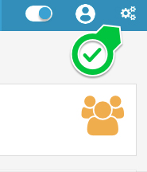
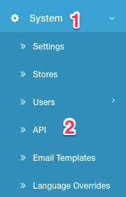

API
===

Application Programming Interface
-----------------------------------

Here you can get general information about the [API](https://en.wikipedia.org/wiki/Application_programming_interface).

Thanks to API you can connect your Arastta store to different services. One of the most important services to connect your Arastta store with is the Arastta Mobile App. Thanks to [Arastta mobile apps](https://arastta.org/mobile), you can manage and update your store from anywhere and at anytime. 

Also, API allows store admins to manage all "Cart" processes from admin panel. For example:

1. New Order
2. Edit Order
3. Order Status Change

Create new API item
-------------------

You can generate an API username and password from your Arastta store's admin panel. Just login your [admin panel](https://arastta.org/docs/user-manual/admin-panel) and click on the **cogs** icon located in the top right corner of the page to reveal settings-related menus.

Under **System** menu, click on the **API** menu to open API management page.

If you already have an API generated, you can see it on this page listed. Click on the **pen** icon to edit your API details. You can enable or disable any API items or edit its username and password.

To generate a new API item, click on the **plus** icon at the top-right of the page.

Fill in the **Username** and **Password** fields and make sure that you have enabled the API item. Click on the save button.

If you want Arastta to generate a complicated password for you, you can click on the **Generate** button and a password will be generated and auto-populated in the Password field.

Arastta allows you to create new APIs for **[Multi-Store](docs/how-to/how-to-build-a-multi-store)** websites. You should choose the API from "**System > Stores > Edit > Option (tab)**", after that API will be valid for the store.

