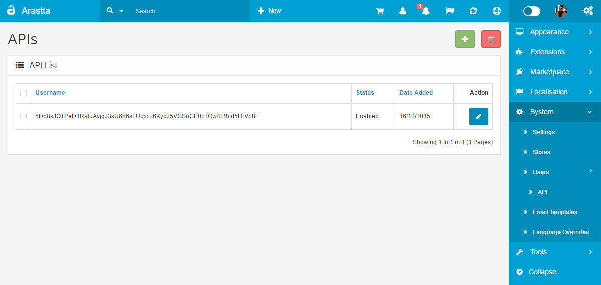

API
===

Application Programming Interface
-----------------------------------

Here you can get general information about the [API](https://en.wikipedia.org/wiki/Application_programming_interface).

In our system, API allows store admins to manage all "Cart" processes from admin panel. For example:

1. New Order
2. Edit Order
3. Order Status Change

Arastta allows you to create new APIs for **[Multi-Store](docs/how-to/how-to-build-a-multi-store)** websites. You should choose the API from "**System > Stores > Edit > Option (tab)**", after that API will be valid for the store.

