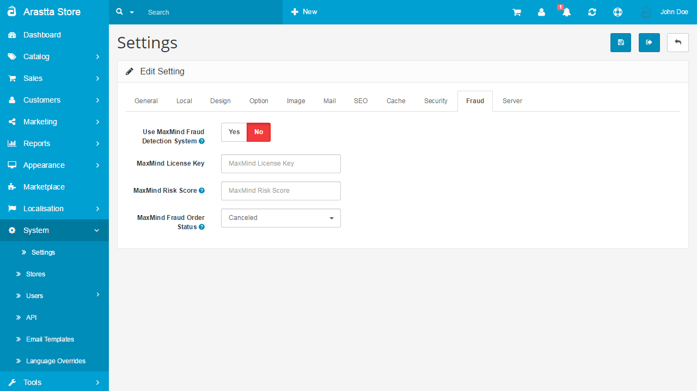

Fraud
==============

Fraud Tab
---------

The Fraud tab under Settings allows you to sign up to use the MaxMind Fraud Detection System for Arastta. Visit [MaxMind](http://www.maxmind.com) for more information.

Arastta supports the highly recommended minFraud service provided by the company MaxMind. Screening over 50 million transactions per month, MaxMind is the industry’s leading provider of online fraud detection tools. With its network of trusted IPs minFraud can isolate potential fraudulent cases by scoring the chance of a transaction being a fraud. The user can decide the score-frame in which transactions should be considered fraud and not be completed.
 
To activate the minFraud for your Arastta store, you will need to get a MaxMind License Key via the official [website](https://www.maxmind.com/en/request-minfraud-service-trial) of the company. Here you can sign-up for a free trial account that contains a license key and 1,000 free queries for the standard service as well as 100 free queries for the premium service. You will need an email account associated with your company/domain name in order to pass the security measures of the registration form. 
 
Now you will need to login to your admin dashboard and navigate to **System>Settings**.

- **Use MaxMind Fraud Detection System:** MaxMind is a fraud detection service. If you don't have a license key you can [sign up here](http://www.maxmind.com/?rId=arastta). Once you have obtained a key, copy and paste it into the field below.
- **MaxMind License Key:** Copy the license key you got from MaxMind here
- **MaxMind Risk Score:** The higher the score the more likely the order is fraudulent. Set a score between 0 - 100. (we recommend using 10-15 at the start and then increase this if you see too many non fraudulent activity being marked as fraud)
- **MaxMind Fraud Order Status:** Orders over your set score will be assigned this order status and will not be allowed to reach the complete status automatically.