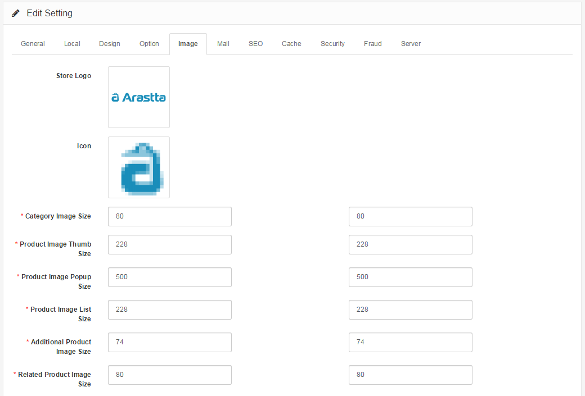

Image
==============

Image Tab
---------

The Image tab under Settings customizes the default images for the store:

- **Store Logo:** Upload a store logo from the store or the admin's computer using [Image Manager](docs/faq/image-manager).
- **Icon:** Upload a [favicon ](http://en.wikipedia.org/wiki/Favicon)for the store using [Image Manager](docs/faq/image-manager).
- **Image Sizes:** Lets you customize the pixel width by length for specific images in the store front.

