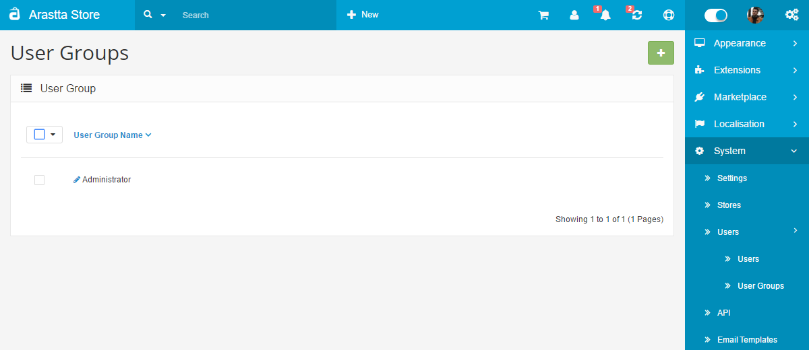
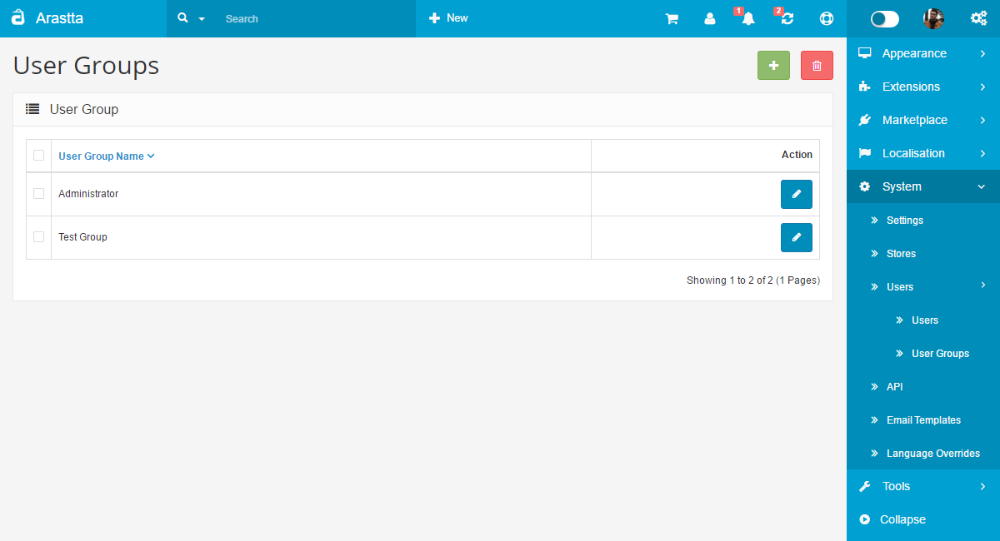
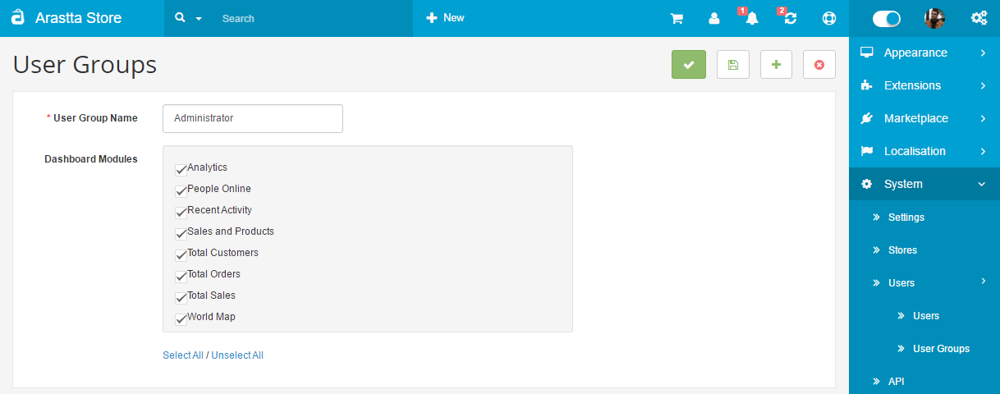
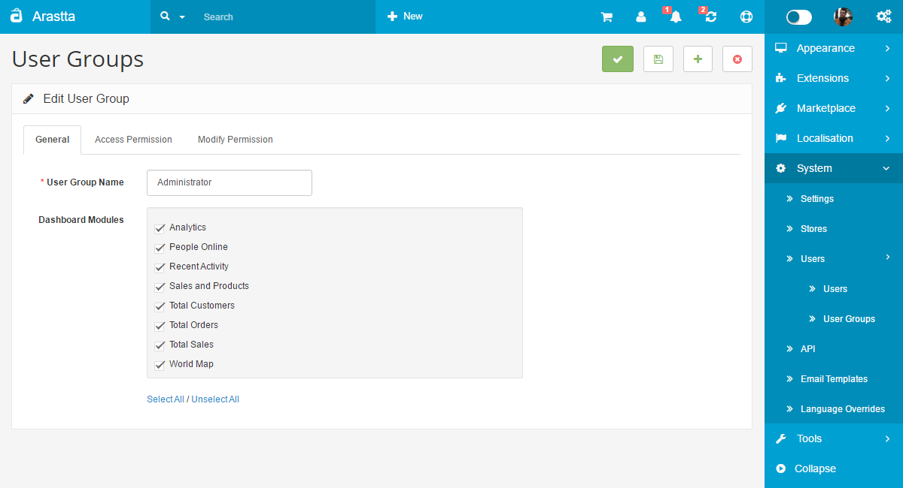
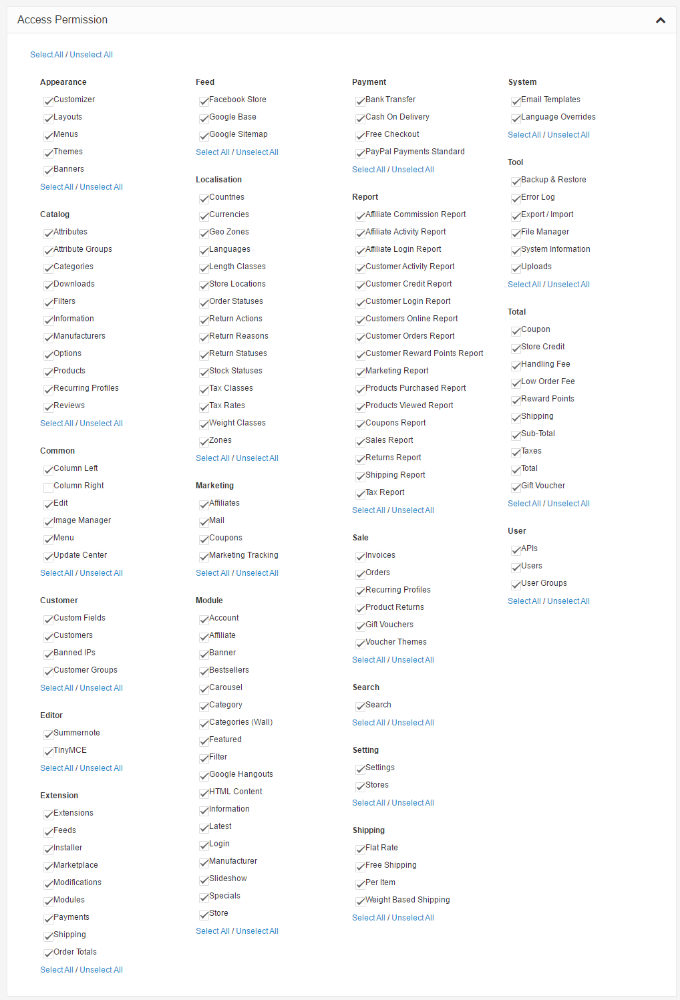
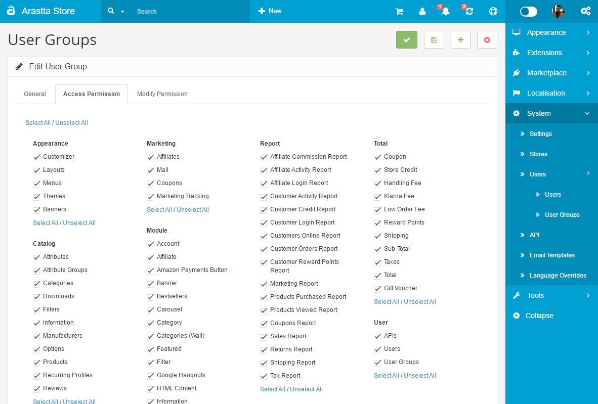

User Groups
======

   You can switch between Basic and Advanced modes from the tabs below.

<ul class="uk-tab" data-uk-tab="{connect:'#doc-tabs', animation: 'fade'}">
    <li><a href="">Basic Mode</a></li>
    <li><a href="">Advanced Mode</a></li>
</ul>

Before you begin creating user profiles, you should visit **System → Users → User Groups** to set specific access and modification permissions. Also you can hide or show dasboard modules from the **General** tab for each group.

<ul id="doc-tabs" class="uk-switcher uk-margin">
    <li markdown="1"></li>
    <li markdown="1"></li>
</ul>

Arastta lets you customize which admin side pages can be accessed by the specific user groups. You must check which pages can be accessed under **Access Permission**, and which page content can be modified under **Modify Permission**. The pages in the box office are displayed according to the top menu sections. For example, catalog/attribute is the Attribute section under Catalog in the top menu of the dashboard.

<ul id="doc-tabs" class="uk-switcher uk-margin">
    <li markdown="1"></li>
    <li markdown="1"></li>
</ul>

<i class="uk-icon-info-circle"></i> Be aware that checking sections in Access Permission lets the user see the information on those pages. If a page in Access Permission is selected, but the page in Modify Permission is unselected; the user will be able to view the information on the page, but will be unable to modify this information.

For the Co-worker group, we chose to allow access and permit modification to the Catalog Section only, but not the rest of the admin panel.

<ul id="doc-tabs" class="uk-switcher uk-margin">
    <li markdown="1"></li>
    <li markdown="1"></li>
</ul>

Arastta provides only one user group installed into the admin side, named Administrator. The Administrator has every box checked under **Access Permission** and **Modify Permission**. It is an intuitive step that users assigned to the Administrator position would need access to all of the admin pages and permission to modify these sections. You can choose to leave the group unchanged, or unselect categories for this group.

You can create multiple user groups, for example Demonstration user group. The Demonstration user group may not have any admin pages checked in **Access Permission** or **Modify Permission**, meaning users added in this group will not be able to access the admin side or modify any features of the shop.
