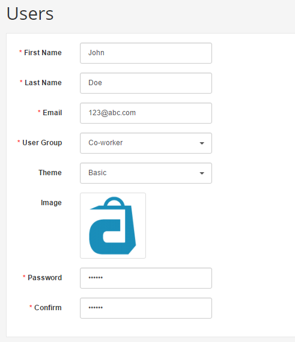
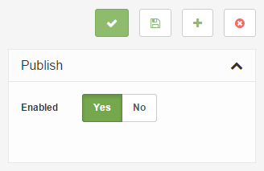
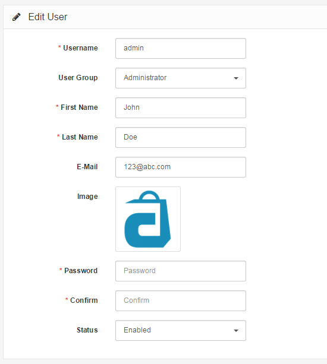
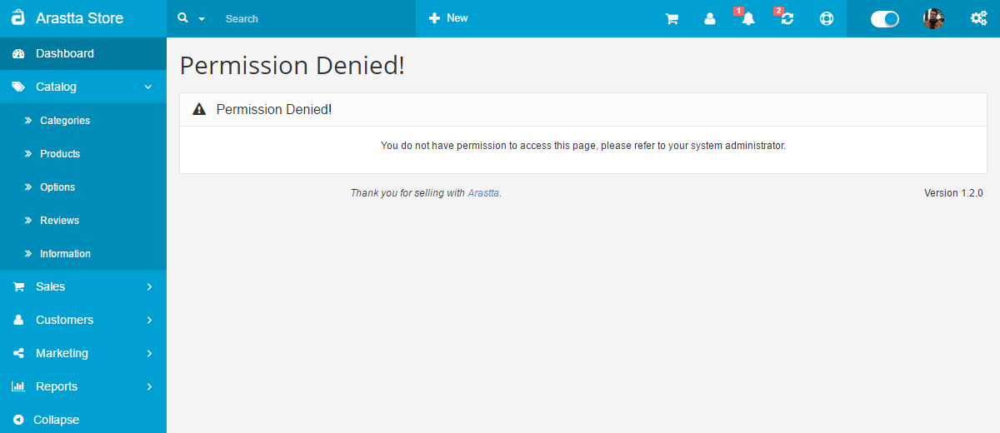

Users
=====

   You can switch between Basic and Advanced modes from the tabs below.

<ul class="uk-tab" data-uk-tab="{connect:'#doc-tabs', animation: 'fade'}">
    <li><a href="">Basic Mode</a></li>
    <li><a href="">Advanced Mode</a></li>
</ul>

Managing the in's and out's of the admin side of an online store can be quite the task for just one person to handle. You may find it necessary to assign administration side permissions to specific people on your team. The User section lets you customize which users can access the admin side of the store, and what sections can be accessed or modified by them.

With the user groups set up, the individual users can be saved to the administration side of your store under **System → Users → Users**. Clicking "**Add New**" will bring you to the user form below. Aside from the basic user information, a password must be created for the user to login to the dashboard. The User Group selected from the drop down box will assign specific permissions to the user. The status lets you choose to enable the user to be able to login, or disable the user from logging in to the dashboard.

<ul id="doc-tabs" class="uk-switcher uk-margin">
    <li markdown="1">

</li>
    <li markdown="1"></li>
</ul>

### Permission denied

The user can access the dashboard the same way the administrator would, with the exception of entering their specific username and password. See [Admin interface](docs/user-manual/admin-panel) for more information.

Our user, John Doe, was assigned to the Co-worker group; meaning he will be able to access and modify all the Catalog pages except **Manufacturers**. He will not be able to access Extensions, Sales, System, or Reports. The following screenshot displays what John Doe will view when he tries to access the Extensions page.

If John Doe was permitted access to this page, but not modify it, the following warning message would appear if he tried to save an edit:

"Warning: You do not have permission to modify manufacturers!"
