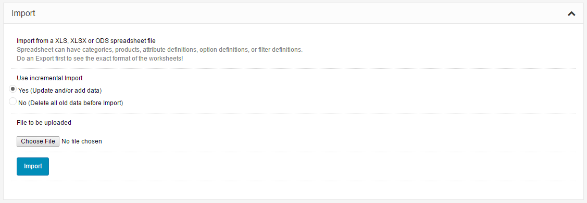
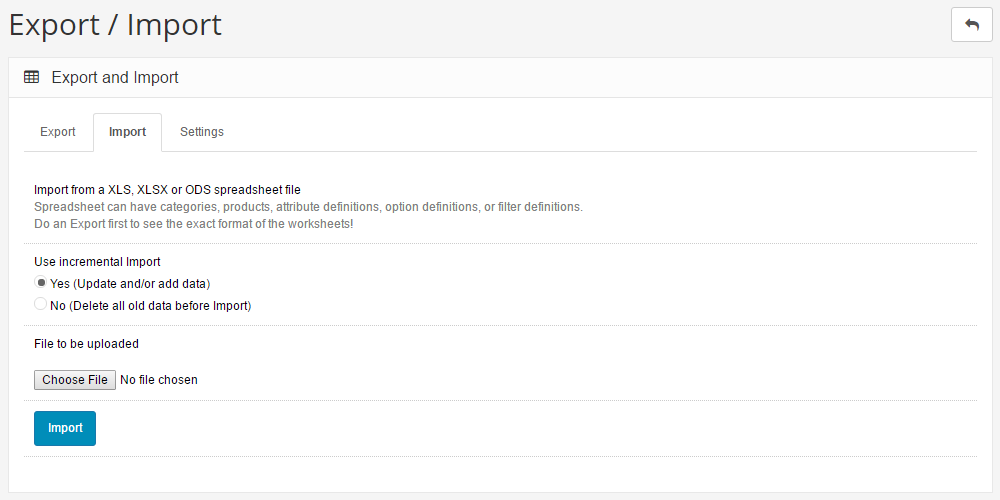
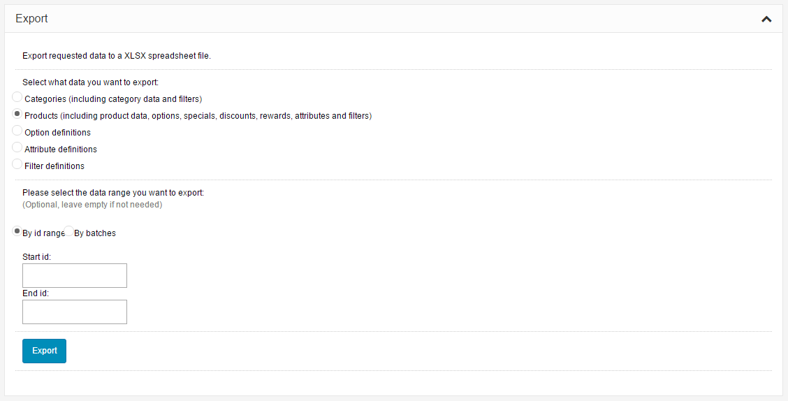
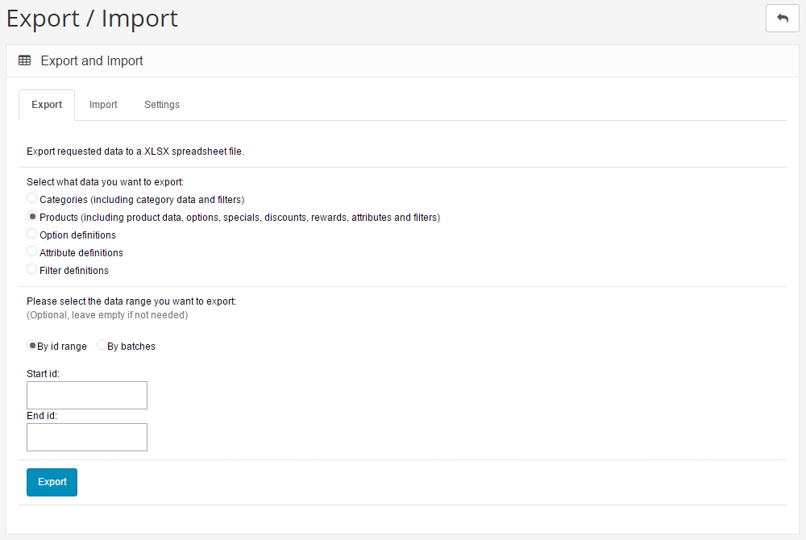
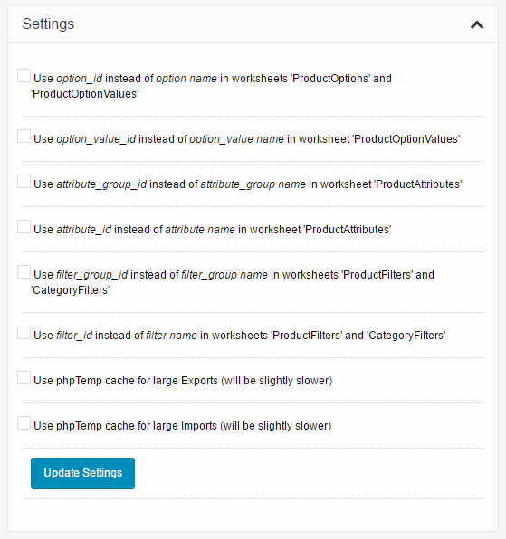
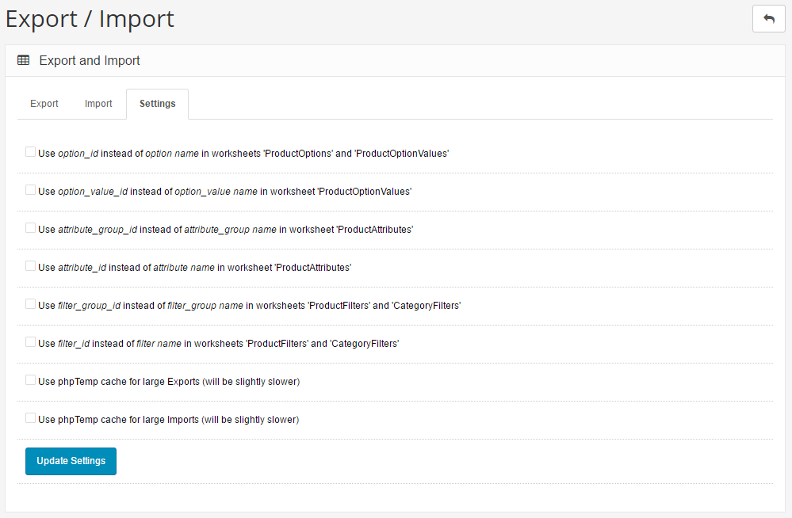

Export / Import
===============

   You can switch between Basic and Advanced modes from the tabs below.

<ul class="uk-tab" data-uk-tab="{connect:'#doc-tabs', animation: 'fade'}">
    <li><a href="">Basic Mode</a></li>
    <li><a href="">Advanced Mode</a></li>
</ul>

The Import/Export Tool allows the admin user to do a bulk export of all the categories, products, options and attributes to an Excel spreadsheet file. The spreadsheet file can be edited offline and then be re-imported to the Arastta database.

<ul id="doc-tabs" class="uk-switcher uk-margin">
    <li markdown="1"></li>
    <li markdown="1"></li>
</ul>

The Import can be incremental, that is, data is updated or added to the Arastta server. Or it can be non-incremental which means all old data is first deleted before the Import.

<ul id="doc-tabs" class="uk-switcher uk-margin">
    <li markdown="1"></li>
    <li markdown="1"></li>
</ul>

The Export can be limited to certain data ranges only for products and categories.

Multiple languages are supported, too.

Requirements and Limitations
----------------

Memory requirements can be quite high.

Not every shared web hosting account supports a high process memory usage. 
Therefore, if you use a basic shared web hosting account, no more than a few thousand products can be exported or imported at a time. 
Use a more dedicated web hosting account if a higher number of products are to be processed in one go. Or export and import multiple times in smaller batches.

<ul id="doc-tabs" class="uk-switcher uk-margin">
    <li markdown="1"></li>
    <li markdown="1"></li>
</ul>
