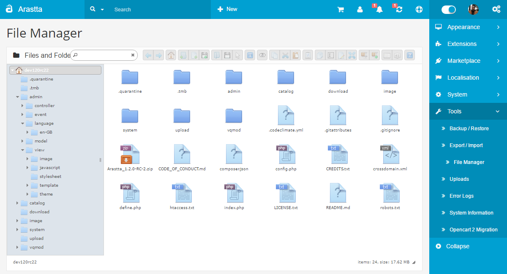

File Manager
============

Forget your FTP details. Thanks to its File Manager, Arastta allows you to manage every file/folder about your store withing one-click away.

Features
--------

* All operations with files and folders on a remote server (copy, move, upload, create folder/file, rename, etc.)
* High performance server backend and light client UI
* Multi-root support
* Local file system, MySQL, FTP volume storage drivers
* Background file upload with Drag & Drop HTML5 support
* List and Icons view
* Keyboard shortcuts
* Standard methods of file/group selection using mouse or keyboard
* Move/Copy files with Drag & Drop
* Archives create/extract (zip, rar, 7z, tar, gzip, bzip2)
* Rich context menu and toolbar
* Quicklook, preview for common file types
* Edit text files and images
* "Places" for your favorites
* Calculate directory sizes
* Thumbnails for image files
* Easy to integrate with web editors (elRTE, CKEditor, TinyMCE)
* Flexible configuration of access rights, upload file types, user interface and other
* Extensibility
* Simple client-server API based on JSON