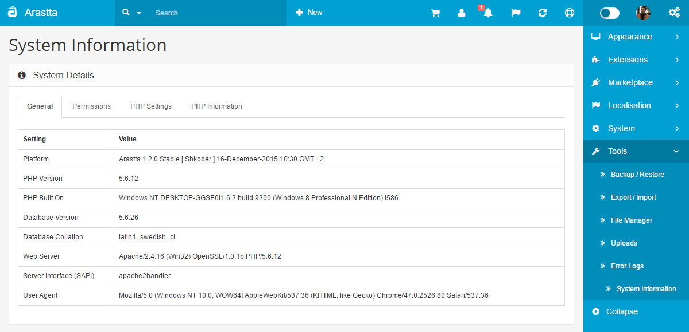
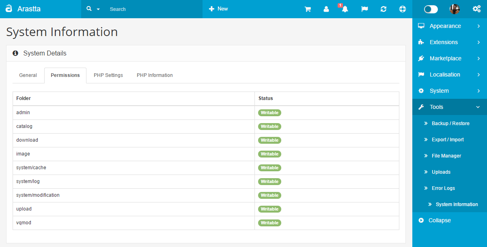
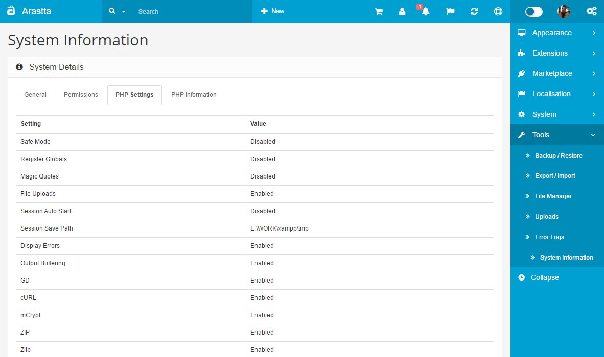
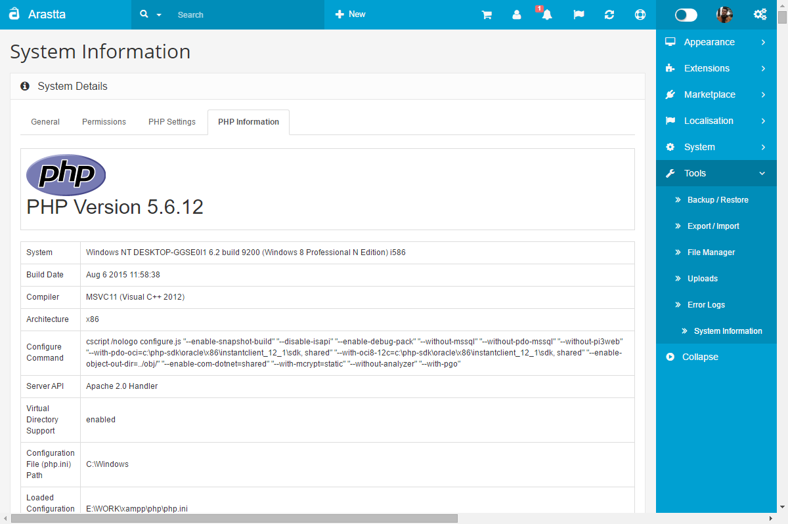

System Information
=======

Arastta Core settings with information useful for management of your store.

This tool provides useful information about your host server environment, including operating system, database and PHP settings, and directory information. You can navigate to four different screen: General, Permissions, PHP Settings, and PHP Information. Each screen provides detailed information about that aspect of your Arastta store. This information is very helpful when you are troubleshooting setup problems.

* Note that none of these settings can be changed from these screens. This must be done in different locations throughout your Arastta installation, depending on the specific setting.
* Many settings on the Settings screen can be changed from the System → Settings screen. Some settings shown here depend on your host server configuration and cannot be changed from inside Arastta.

### How to access

Select Tools → System Information from the drop-down menu of the Arastta Admin Panel.

### Details Tabs

* General
* Permissions
* PHP Settings
* PHP Information

### General

This screen shows information about the operating environment for your Arastta store.

* **Platform:** Provides the current version of Arastta. It is recommended that it is always to to day and using the current stable release.
* **PHP Version:** Provides the current version of PHP server side script that is being used for this installation of Arastta.
* **PHP Built on:** Provides details of the principle operating system which the webserver that Arastta is running on.
* **Database Version:** Provides the current version of the MySQL database being used by the installation of Arastta.
* **Database Collation:** How the MySQL databased is structured for the information used by Arastta.
* **Web Server:** Provides the current type and version of web server which the installation of Arastta is running on.
* **Server Interface (SAPI):** The script that permits interaction between the web server (in most cases, Apache) and the PHP scripting language.
* **User Agent:**The summary of the current user's local machine's operating system and browser information which is used to create an unique session ID for access and functionality within the Arastta web site.

### Permissions

This screen shows a list of the directories that the webserver should have write access to. Please note that all directories listed on this page should say **Writable**. If not, you may need to change the permissions to be able to install and use Arastta successfully.

### PHP Settings

These screen shows the Relevant PHP Settings information. If any of these is highlighted as incorrect should be taken care of to rectify the situation.

* **Safe Mode:** Recommended setting: Enabled
* **Register Globals:** Recommended setting: Disabled
* **Magic Quotes:** Recommended setting: Disabled
* **File Uploads:** Recommended setting: Enabled
* **Session Auto Start:** Recommended setting: Disabled
* **Session Save Path:** Recommended setting: Site dependent
* **Display Errors:** Recommended setting: Disabled
* **Output Buffering:** Recommended setting: Disabled
* **GD:** Recommended setting: Enabled
* **cURL:** Recommended setting: Enabled
* **mCrypt:** Recommended setting: Enabled
* **ZIP:** Recommended setting: Enabled
* **Zlib:** Recommended setting: Enabled
* **Mbstring:** Recommended setting: Enabled
* **Iconv:** Recommended setting: Enabled
* **Open basedir:** Recommended setting: Site dependent
* **Disabled Functions:** Recommended setting: Site dependent

### PHP Information

This screen displays the full configuration of the PHP server side scripting language that Arastta runs on, together with all the associated system information that goes towards the creation of the web server. It is the output of an integrated php.info script built into Arastta.

PHP is installed, and runs on the server (hence the server side above), and therefore all the settings are made on the server. The visitor to the web site does not need to have anything special running on their local machine in order to view or use any of the extra functionality that PHP gives to the web site.

All the settings that are ever likely to be needed are displayed here. Any changes that are required would be made within the php.ini and other configuration files on the web server.

How much control a web site owner has over this information depends on whether they own the server or if the server host is flexible in their customer approach.

It is a good practice to know the limitations of a particular server installation. This screens output is used to find detailed information about how PHP is implemented on the server.

For full details on the information contained within the PHP Info screen visit: [phpinfo](http://php.net/phpinfo).

### Quick Tips

* If you are having problems installing extensions, uploading files, or changing configuration options, check the Permissions screen to make sure you have permission to write to files on your web server. The "**Status**" of the directories should be "**Writable**". If not, you may be unable to upload or edit files in these directories.
* When you are seeking help with setup problems, for example in a Arastta web forum, it is very helpful to post specific information about your Arastta installation. This screen is an easy way to find all of this information in one place.
